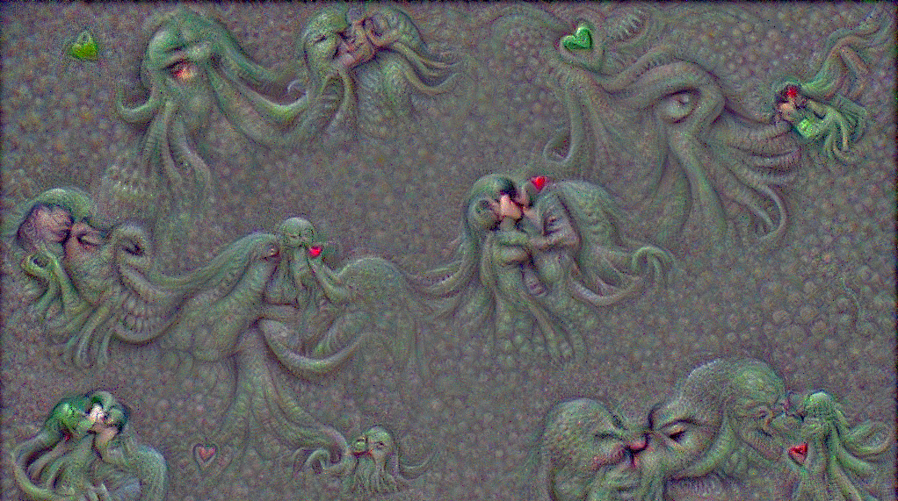
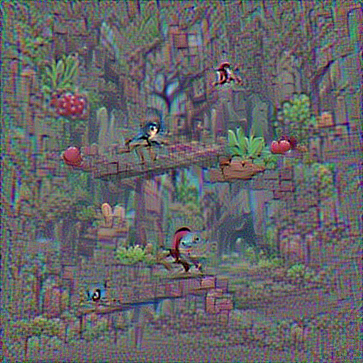
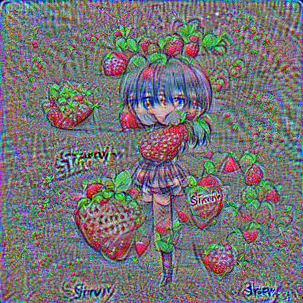

# (Yet another) CLIP Image Generator

Dear seeker!

This is yet another generative gradient-descent engine using OpenAI's 
[CLIP](https://github.com/openai/CLIP/) network to rate the similarity 
between generated pixels and a CLIP-feature, typically given in the 
form of natural language.


(*kissing cthulhu*)

CLIPig uses no sophisticated image generation network, just ordinary RGB pixel planes.

The outstanding thing, maybe, and the reason for developing it, is it's configuration interface.
I got pretty tired of constantly changing actual code during various experiments so i started
this new project which fulfills *most* desires through yaml configuration files. 


### example yaml config

```yaml
resolution: 1024
epochs: 200

learnrate: 1.5
learnrate_scale: (1. - .95 * pow(t, 5.))   # 't' is training epoch in [0, 1] range

targets:

  - name: random sampler

    transforms:
      - noise: 0.1 0.2 0.3
      - random_scale: .1 1.
      - random_crop: 224

    features:
      - text: some text feature to match
      - text: some text feature to avoid
        weight: -1.
      - image: /path/to/image.png
        loss: L2  # 'cosine' is default, 'L1' and 'L2' are also possible

  - name: image adjustments
    end: 30%
    constraints:
      - mean:
          above: .1 .2 .3
      
# post-processing is applied after each back-propagation step
postproc:
  - blur: 3 .35
    end: 50%    
```

As you can see, it supports 
- expressions
- multiple targets
- multiple features per target
- CLIP features from texts or images
- negative weights!
- arbitrary pixel transformation chains
- a couple of other constraints that can be added to the loss
- a couple of image post-processing effects 
- scheduling via `start` and `end` parameters

---

Once the interface is settled i'll write down the documentation. 

Currently, to get started switch to a virtual environment that contains 
the `torch` library matching your CUDA drivers and then

```bash
python clipig.py examples/strawberries.yaml -o ./images/
```

It will save an image to `./images/strawberries.png`. If such a file exists, 
a number is attached to the filename or incremented automatically. It will never
overwrite an existing file.

There is a **GUI** version for **interactive fun** but it's even more hacked together
than the rest. Install `pyqt5` and start it with:

```bash
python clipig-gui.py
```

It's possible to change the configuration during training which is funny and horrible alike. 
It will not save snapshots by default, instead they are immediately displayed for your
pleasure and can be saved with `CTRL-S`. 

--- 

Here's a motivating [article](https://defgsus.github.io/blog/2021/04/28/malazan-clip-features.html)
whose images where created with some former code.


## Known issues

The author does not have enough time!

Then there are bugs in there and stuff that is not yet tested 
or even implemented.

But the major concern is the image quality. Just adjusting pixels so that CLIP does like them
generally creates horrible grids and artifacts. A good first step to avoid them is 
a relatively small learning rate and random rotation like:

```yaml
- random_rotate:
    degree: -10 10
    center: 0 1
```

Still it's not eye-friendly to look at without a little gaussian blur. It's possible to use
a gaussian blur as a training constraint and add it to the loss function of the 
particular target window. That leads to much better results already. And after a few hours of
staring at those images they get better and better anyways.

The other problem is the uniform *depth* of images. CLIP seems to be good with object 
boundaries and textures. But that does not automatically help to divide an image into 
significant foreground and less significant background. Generally, the image often tends
to be a uniform something with some objects carved out. Although, there are counter 
examples that show promise:


(*2d platformer*)

If you feel you can help or want to discuss things, please 
[open an issue](https://github.com/defgsus/clipig/issues).


---


(*strawberry* - well, i did not make this up. things are sometimes strangely 
interconnected in CLIP)

