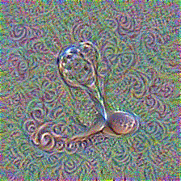
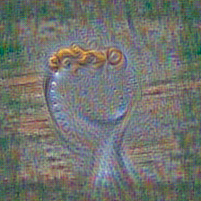

# [CLIPig](https://github.com/defgsus/CLIPig/) documentation

[CLIPig](https://github.com/defgsus/CLIPig/) generates images by using the [CLIP](https://github.com/openai/CLIP/) network as an art critique. 

A bunch of pixels is continuously adjusted to increase the 
similarity of their [features](#targetsfeatures) with some user-defined
target features. Both features are derived via [CLIP](https://github.com/openai/CLIP/).

Through [backpropagation](https://en.wikipedia.org/wiki/Backpropagation),
the most common method of training artificial neural networks, the
dissimilarity of trained features and target features is 
translated back into pixel values which adjust the initial bunch of pixels
just slightly. If we do this long enough, with some
artistic variation in the processing pipeline, an actual image emerges.  

[CLIPig](https://github.com/defgsus/CLIPig/) is designed to allow a lot of control over those *variations* 
which requires a bit of documentation.

Please browse through the *walk-through* to get an overview and follow 
the links to the reference pages and any point.

- [Walk-through](#walk-through)
- [Command line interface](#command-line-interface)
- [Expressions](#expressions)
- [Expression variables](#expression-variables)
- [Transforms](#transforms)
- [Constraints](#constraints)
- [Parameter reference](#reference)


## Walk-through

First of all, experiments are defined in [YAML](https://yaml.org/) 
files. I actually prefer [JSON](https://www.json.org/) but it 
does not support comments out of the box and is quite strict 
with those trailing commas and all that.. Anyways, the basic 
desires of defining lists and key/value maps are indeed
quite human-friendly in YAML: 

```yaml
a_list:
  - first entry
  - second entry

a_map:
  first_key: first value
  second_key: second value  # a comment
```

And that's all to know about YAML for our purposes. 

Now in [CLIPig](https://github.com/defgsus/CLIPig/) the *desire* for an image is expressed as a 
[target](#targets).
There can be multiple targets and each target can have multiple 
target [features](#targetsfeatures).

```yaml
targets:
  - features:
      - text: a curly spoon
```

To follow the walk-through, call

```shell script
python clipig-gui.py
```

then paste the code inside the editor (top-left one) and 
press `Alt-S` to start training and watch the image 
emerge in realtime.

So, what does the image look like?


Yeah, well... I promised *images* and now i'm showing nothing 
more than a psychedelic pixel mess. 

But indeed, [CLIP](https://github.com/openai/CLIP/) does think this image to be **95%** similar 
to the words **a curly spoon**. This is a top score that
an actual photo would rarely get and a classic example of an 
[adversarial](https://en.wikipedia.org/wiki/Adversarial_machine_learning)
in machine learning. 

To make it look more like an actual image we'll add some of those 
artistic variations, spoken of earlier. The art is in showing 
different parts of the image to [CLIP](https://github.com/openai/CLIP/) when evaluating the 
feature similarities. 

This is accomplished via [transforms](#transforms):

```yaml
targets:
  - features:
      - text: a curly spoon
  transforms:
    - random_shift: 0 1
```


The [random_shift](#targetstransformsrandom_shift) transformation
simply moves the image center to a random position, before
each evaluation by [CLIP](https://github.com/openai/CLIP/). The edges are wrapped around so the
outcome is actually a repeatable texture! The object of interest
might just not be in it's center. 

Apropos, the object of interest does look a tiny bit spoony to a
human observer but not really, i'd say. There is a lot of curliness
in the background but the spoon does not show as much. 

Also, [CLIP](https://github.com/openai/CLIP/) obviously missed the curliness of the spoon 
because actual letters appeared to increase the similarity 
nevertheless. It got to **50%**. 

Another method to inspire [CLIP](https://github.com/openai/CLIP/) is 
[random rotation](#targetstransformsrandom_rotation). 

```yaml
targets:
  - features:
      - text: a curly spoon
  transforms:
    - random_rotate:
        degree: -90 90
        center: 0.3 .7
```



Each evaluated image is first rotated randomly between -90 and +90 
degree with a random center in the middle 2/3rds of the image. This
does not create a repeatable texture and the edges are typically 
a bit underdeveloped because they get rotated out of the visible 
area some amount of time.

The image shows some good areas with shiny metal and spoony 
curliness but it's still not quite recognizable as a spoon.

Let's jump forward and add some other stuff:

```yaml
targets:
- batch_size: 5
  features:
  - text: a curly spoon on a plate
  transforms:
  - noise: 0.1*ti
  - random_shift: -.1 .1
  - random_rotate:
      degree: -3 3
      center: 0.3 .7
  constraints:
  - blur: 
      kernel_size: 31*ti
```


In desperation we just throw more computation at the
problem by increasing the [batch size](#targetsbatch_size). 
This results in a runtime of about 2 minutes on 1500 cuda cores.

Then, `on a plate` was added to the target text to make 
[CLIP](https://github.com/openai/CLIP/) somewhat more opinionated about the background.

Some [noise](#targetstransformsnoise) is added to each image 
before showing it to [CLIP](https://github.com/openai/CLIP/) and a [gaussian blur](https://en.wikipedia.org/wiki/Gaussian_blur) is added
to the backpropagation [loss](https://en.wikipedia.org/wiki/Loss_function).  

For details about the `noise: 0.1*ti` line, please check out the
[expressions](#expressions) section. Sufficient to say that it 
decreases the amount of noise over time. 

The noise makes [CLIPig](https://github.com/defgsus/CLIPig/) kind of *think twice* about the way 
a pixel is adjusted. The blur as a training loss tends 
to blur out the areas where [CLIP](https://github.com/openai/CLIP/) is not interested in, while 
the points of interest are constantly updated and are not 
blurred as much. Unfortunately both methods also help to 
create new artifacts. And this is where those
*variations* start to become *artistic*. 
It certainly takes some patience.

And maybe the correct language. What if we change the target 
text to `a photo of a curly spoon`?



Ah, i see where [CLIP](https://github.com/openai/CLIP/) is going to. Indeed funny, 
but not enough for a proof-of-concept.

```yaml
targets:
- batch_size: 5
  features:
  - text: close-up of a spoon with a curly handle
  transforms:
  - noise: 0.1
  - repeat: 3
  - random_rotate:
      degree: -30 30
      center: .4 .6
  - center_crop: 224
  constraints:
  - blur: 
      kernel_size: 51

postproc:
- border:
    size: 1 1
    color: 0.15 0.1 0.05
```

 


Changes made:

- [Noise](#targetstransformsnoise) and [blur](#targetsconstraintsblur) 
are kept at high values throughout the whole training. 
- The [text target](#targetsfeaturestext) is made extra specific.
- The [repeat](#targetstransformsrepeat) and 
  [center crop](#targetstransformscenter_crop) transforms
  help avoiding the *under-development* of the corners by the 
  [random rotation](#targetstransformsrandom_rotation).
- A [post processing](#postproc) effect adds a small 
  [border](#postprocborder) that forces the contents to be 
  created more in the center of the image instead of close 
  to or on one of the repeating edges.
  
  Post-processing effects are applied every epoch and change
  the image pixels directly without interfering with the
  backpropagation stage. All [transforms](#transforms) that
  do not change the resolution are available as 
  [post processing](#postproc) effects.

There is not much else visible in the images because the 
`close-up of ...` in the target text and, more profoundly, 
the high noise and blur constraints do not allow anything 
else to emerge.

Just to give an idea what [CLIP](https://github.com/openai/CLIP/) is actually *thinking* about
curly spoons, the target text is replced with with 
`a lot of curly spoons` and the noise value is lowered to 
allow some more uncertainty in the resulting image:


There are some different concepts visible. Curls made of
spoon faces, curls with interwoven spoon fragments and 
an actual head with curly hair, which probably is to be 
expected when using such a specific adjective. 

The **contrast** of the image is not as good as the previous 
ones. Generally, [CLIP](https://github.com/openai/CLIP/) does not require a lot of contrast to 
identify things so it's not automatically increased to *normal*
levels. The previous images had a higher noise amount which
actually increased the contrast because areas of low contrast
simply disappear in the noise. Unfortunately, the high noise
deviation only lets things emerge where [CLIP](https://github.com/openai/CLIP/) is very certain
about. *Curly spoons* do not represent a well-known archetype, 
it seems.

There is a trick, though! We can show [CLIP](https://github.com/openai/CLIP/) the image with 
much less contrast so the changes it applies become
larger changes in the final image.

```yaml
targets:
- batch_size: 5
  features:
  - text: a lot of curly spoons
  transforms:
  - noise: 0.1
  - repeat: 3
  - random_rotate:
      degree: -30 30
      center: .4 .6
  - center_crop: 224
  - mul: 1./5.         # [CLIP](https://github.com/openai/CLIP/) only sees 1/5th of the color range
  constraints:
  - blur:
      kernel_size: 51
  - saturation:        # The desired saturation is lowered
      below: .01       
      weight: 10.
postproc:
- border:
    size: 1
    color: 0.15 0.1 0.05
```


The [mul transformation](#targetstransformsmul) reduces
the color range that [CLIP](https://github.com/openai/CLIP/) is seeing so the resulting color
range is increased. Of course, this also increases the 
saturation a lot so the 
[saturation constraint](#targetconstraintssaturation)
is used to reduce it to acceptable levels.

I'll end this experiment here because my almost-3 years old 
clearly approves the image to depict *curly spoons*. 
And you should know the basic pieces now, that are needed to 
create your desired fantasy images. 

But there's one thing left: **How do i increase 
the resolution?**

Okay, let's start with a new theme. Take the curly spoon script
from above and replace the text with `h.p. lovecraft at a 
birthday party`.


If you don't know Lovecraft, he's one of the earliest and 
spookiest fantasy authors with stories about creepy and
*unearthly* things and obviously enough fan-art has found it's
way into [CLIP](https://github.com/openai/CLIP/)'s convolutional weight matrices. The green guy
there must be a children's birthday version of *Cthulhu*, an 
age-old murderous god living in the sea, waiting for a come-back
as leader of a blood-thirsty army of fanatics.

Why does Lovecraft have .. ahh, two faces? Well, my personal 
feeling is that [CLIP](https://github.com/openai/CLIP/) does not reject a face just because 
it's melted together with parts of other faces or not at the
right place above the shoulders, aso. Similarity to *Lovecraft at
a birthday party* got to **61%**, despite the creepy head. 
[CLIP](https://github.com/openai/CLIP/) just imagined the face at two different 
positions. If we continue training for long enough, it *might* 
correct the face. But only, if it increases similarity to the
target feature.

Anyways, let's increase the resolution by putting this line
in front:

```yaml
resolution: 224*2
```

This is now twice the width and height of [CLIP](https://github.com/openai/CLIP/)'s image input
window or four times as much pixels as before.


What did happen? Well, the 
[center_crop](#targetstransformscenter_crop) transformation
crops a [CLIP](https://github.com/openai/CLIP/)-sized window from the middle of a 448² image. 
Now the effect of the random rotation is actually visible. 
But most of the  


Just go ahead, play with [CLIPig](https://github.com/defgsus/CLIPig/) and consume a lot of your 
life and work time. If stuck, check the [reference](#reference) 
and the lists of available [transforms](#transforms) and 
[constraints](#constraints).

We could add the [random_shift](#targetstransformsrandom_shift)
transform to move the [CLIP](https://github.com/openai/CLIP/) window to every position of the 
training image. Let's just do that and also increase the
[batch_size](#targetsbatch_size) from **5** to **20** since
we have 4 times the pixels to process.


There are many Lovecrafts now. It's like in this 
John Malkovich movie when John Malkovich truckles through the
door that leads into his own head. There's even a body without
a head.

Clearly, [CLIP](https://github.com/openai/CLIP/) does not get a good view of the whole image but
just assembles parts of it without the knowledge of how they
relate to each other.

The [random_scale](#targetstransformsrandom_scale) 
transformation allows us to *'zoom'* in or out of the
image so we can show [CLIP](https://github.com/openai/CLIP/) a mixture of the whole image
and details of it.

Imagine a zoom, or scale, of **0.5** on the trained image.
That would mean that [CLIP](https://github.com/openai/CLIP/) sees twice as much in each 
direction or 4 times as much in the whole. Exactly or new
resolution. Of course it would not look better than resizing an
image to a larger resolution with some bilinear filtering.
Well, not entirely. The noise and artifacts are of higher
resolution ;) 


Now, at some point in training we randomly 
[scale](#targetstransformsrandom_scale) 
between the full resolution and the zoomed-in details
and enable the [random_shift](#targetstransformsrandom_shift).

`0. if t < .4 else 1.` is python/[CLIPig](https://github.com/defgsus/CLIPig/) talk for 
*zero below 40% else one*. 


```yaml
epochs: 300
resolution: 224*2
targets:
  - batch_size: 20
    features:
      - text: h.p. lovecraft at a birthday party
    transforms:
      - noise: 0.1
      - repeat: 3
      - random_shift:
          - 0
          - 0 if t < .4 else 1. 
      - random_rotate:
          degree: -30 30
          center: .4 .6
      - random_scale:
          - .5
          - .5 if t < .4 else 1.
      - center_crop: 224
      - mul: 1./5.
    constraints:
      - blur:
          kernel_size: 51
      - saturation:
          below: .01
          weight: 10.
postproc:
  - border:
      size: 1
      color: 0.15 0.1 0.05
```


It's quite good at parts but, wait! There's already another 
Lovecraft developing in the background. And that's what is to be 
expected. The training target of that Lovecraftian party is
simply applied at all points of the image and [CLIP](https://github.com/openai/CLIP/) won't 
jude the whole frame less similar to the target when every
face is that of Howard Phillips???.

The above snapshot is kind'o good but the repetitions will
increase with higher resolutions. It would be more like a fractal
of H.P.'s birthday party. 

... Well actually, let's see *a fractal of H.P.'s birthday party*


Well done CLIP, well done.

But back to the topic


I guess, everyone has to judge for themselves if this
is worth 8 minutes of GPU time. Personally, i am quite 
excited and would like to continue..


## command line interface

A yaml file is rendered via

```shell script
python clipig.py demo.yaml -o images/
```

to produce a [PNG](https://en.wikipedia.org/wiki/Portable_Network_Graphics)
file at `images/demo.png`. When called again, `images/demo-1.png` will be 
created, `images/demo-2.png` the third time, aso.. 

Generally, `clipig.py` never overwrites existing files. 

The `-o` (or `--output`) option is not mandatory but it's good practice
to store those images in separate directories because they tend to grow
in number.

You can specify an actual filename with `-o /path/image.png`, otherwise
the name of the yaml file is used. Still, if `/path/image.png` already
exists, `/path/image-1.png` will be created.

[CLIPig](https://github.com/defgsus/CLIPig/) also stores a `<filename>.yaml` file besides the image, if there
does not exist one already, which holds the complete configuration with 
all defaults and the runtime in seconds as comment on the top. 

Multiple yaml files are merged into one set of parameters, e.g.:

```shell script
python clipig.py best-meta-settings.yaml specific.yaml
```

will parse `best-meta-settings.yaml` and then add anything
from `sepcific.yaml` on top. List entries 
like [targets](#targets) will be appended to the previous list.


## Expressions

[CLIPig](https://github.com/defgsus/CLIPig/) supports expressions for all parameters. Some parameters
also support [variables](#expression-variables) 
and the expression will be evaluated
every time the value is needed. 

E.g., if you want thrice the [CLIP](https://github.com/openai/CLIP/)-resolution of 224x224 pixels
but are too lazy to calculate it, just say:

```yaml
resolution: 224*3
```

> **Note**: Parameters that expect lists (like **resolution** above)
> copy a single value to all entries of the list. A list can 
> be specified with 
> - YAML syntax:
>   ```yaml
>   resolution: 
>     - 640
>     - 480
>   ```
> - with commas:
>   ```yaml
>   resolution: 640, 480
>   ```
> - or simply with spaces
>   ```yaml
>   resolution: 640 480
>   ```
> If you type expressions, you might want to use spaces or 
> commas. In cse of list parameters you'll need to use the 
> YAML lists:
> ```yaml
> resolution:
>   - 224 * 3
>   - pow(224, 1.2)
> ``` 


The result of an expression is automatically converted to 
the desired type. So even if your `resolution` expression 
generates a float it will be cast to integer before being used.

> **Note**: Divisions through zero and stuff like this will
> throw an error and stop the experiment.

## Expression variables

### basic variables

Holds variables that reference the current frame time.

- #### `epoch` variable

  type: `int`

  The current epoch / frame, starting at zero.
- #### `time` variable

  type: `float`

  The current epoch / frame divided by the number of epochs, or in
  other words: A float ranging from **0.0** (start of training) to 
  **1.0** (end of training).
- #### `time_inverse` variable

  type: `float`

  One minus the current epoch / frame divided by the number of epochs, or in
  other words: A float ranging from **1.0** (start of training) to 
  **0.0** (end of training).
### resolution variables

Holds the resolution of the training image.

- #### `resolution` variable

  type: `[int, int]`

  The resolution of the training image as list of **width** and **height**.
- #### `width` variable

  type: `int`

  The width of the training image.
- #### `height` variable

  type: `int`

  The width of the training image.
### learnrate variables

The current values of [learnrate](#learnrate) and [learnrate_scale](#learnrate_scale)
which can be expressions themselves.

- #### `learnrate` variable

  type: `float`

  The currently used [learnrate](#learnrate)
- #### `learnrate_scale` variable

  type: `float`

  The currently used [learnrate_scale](#learnrate_scale)
### target feature variables

Variables available to [target features](#targetsfeatures)

- #### `similarity` variable

  type: `float`

  The [cosine similarity](https://en.wikipedia.org/wiki/Cosine_similarity)
  of the [CLIP](https://github.com/openai/CLIP/)-representation of the current, transformed image area 
  with the desired feature.
  
  The value is in the range [-100, 100].
### target constraint variables

Variables available to [constraints](#targetsconstraints)

- #### `similarity` variable

  type: `float`

  The mean of all [cosine similarities](https://en.wikipedia.org/wiki/Cosine_similarity)
  of the [CLIP](https://github.com/openai/CLIP/)-representation of the current, transformed image area 
  with the desired features of this target.
  
  The value is in the range [-100, 100].


## Transforms

Transforms shape the area of the trained image before showing
it to [CLIP](https://github.com/openai/CLIP/) for evaluation. 
  
Here's a list of all available transformations:

- [add](#targetstransformsadd): Adds a fixed value to all pixels.
- [blur](#targetstransformsblur): A gaussian blur is applied to the pixels.
    See [torchvision gaussian_blur](https://pytorch.org/vision/stable/transforms.html#torchvision.transforms.functional.gaussian_blur).
- [border](#targetstransformsborder): Draws a border on the edge of the image. The resolution is not changed.
- [center_crop](#targetstransformscenter_crop): Crops an image of the given resolution from the center.
    See [torchvision center_crop](https://pytorch.org/vision/stable/transforms.html#torchvision.transforms.functional.center_crop).
- [clamp](#targetstransformsclamp): Clamps the pixels into a fixed range.
- [crop](#targetstransformscrop): Crops a specified section from the image.
- [edge](#targetstransformsedge): This removes everything except edges and generally has a bad effect on image
    quality. It might be useful, however...
- [fnoise](#targetstransformsfnoise): Adds noise to the image's fourier space.
- [mul](#targetstransformsmul): Multiplies all pixels by a fixed value.
- [noise](#targetstransformsnoise): Adds noise to the image.
- [random_crop](#targetstransformsrandom_crop): Crops a section of the specified resolution from a random position in the image.
    See [torchvision random_crop](https://pytorch.org/vision/stable/transforms.html#torchvision.transforms.functional.random_crop)
- [random_rotate](#targetstransformsrandom_rotate): Randomly rotates the image.
- [random_scale](#targetstransformsrandom_scale): Randomly scales an image in the range specified.
    See [torchvision RandomAffine](https://pytorch.org/vision/stable/transforms.html#torchvision.transforms.RandomAffine).
- [random_shift](#targetstransformsrandom_shift): This randomly translates the pixels of the image.
- [random_translate](#targetstransformsrandom_translate): Randomly translates an image in the specified range.
- [repeat](#targetstransformsrepeat): Repeats the image a number of times in the right and bottom direction.
- [resize](#targetstransformsresize): The resolution of the image is changed.
- [rotate](#targetstransformsrotate): Rotates the image.
- [shift](#targetstransformsshift): This translates the pixels of the image.


All [transforms](#transforms) that do not change the 
resolution of the image are also available as 
[post processing](#postproc) effects.


## Constraints 

Constraints do influence the trained image without using [CLIP](https://github.com/openai/CLIP/).
E.g., the image [mean](#targetsconstraintsmean) can be trained
to be above or below a specific threshold. 

Constraints only affect the pixels that are processed by
the [transforms](#transforms) of the [target](#targets). 

Here's a list of all available constraints:

- [blur](#targetsconstraintsblur): Adds the difference between the image and a blurred version to
    the training loss.
- [border](#targetsconstraintsborder): Adds a border with a specific size and color to the training loss.
- [contrast](#targetsconstraintscontrast): Pushes the contrast above or below a threshold value.
- [edge_mean](#targetsconstraintsedge_mean): Adds the difference between the current image and
    and an edge-detected version to the training constraint.
- [mean](#targetsconstraintsmean): Pushes the image color mean above or below a threshold value
- [noise](#targetsconstraintsnoise): Adds the difference between the current image and
    a noisy image to the training loss.
- [normalize](#targetsconstraintsnormalize): Adds image normalization to the training loss.
- [saturation](#targetsconstraintssaturation): Pushes the saturation above or below a threshold value.
- [std](#targetsconstraintsstd): Pushes the [standard deviation](https://en.wikipedia.org/wiki/Standard_deviation)
    above or below a threshold value.


## Reference

#### `verbose`

`int` default: **`2`**

Verbosity level
- `0` = off
- `1` = show progress
- `2` = show statistics

#### `output`

`str` default: **`./`**

Directory or filename of the output. 
- If a directory, it must end with `/`. 
  In that case, the filename will be the name of the yaml config file. 
- If a filename, it must end with `.png`. Note that a number is attached to the 
  filename or is automatically increased, if the file already exists.

#### `snapshot_interval`

`int, float` default: **`20.0`**

Interval after which a snapshot of the currently trained image is saved. 

A float number specifies the interval in seconds. An integer number specifies 
the interval in number-of-epochs.

#### `epochs`

`int` default: **`300`**

The number of training steps before stopping the training, not including batch sizes. 

For example, if the number of epochs is `100` and a target has a batch_size of `10`, 
then `1000` training steps will be performed.

#### `start_epoch`

`int` default: **`0`**

The number of epochs to skip in the beginning. 

This is used by the GUI application to continue training after config changes.

#### `resolution`

`list of length 2 of int` default: **`[224, 224]`**


expression variables: [basic](#basic-variable)

Resolution of the image to create. A single number for square images or two numbers for width and height.

#### `model`

`str` default: **`ViT-B/32`**

The pre-trained [CLIP](https://github.com/openai/CLIP/) model to use. Options are `RN50`, `RN101`, `RN50x4`, `ViT-B/32`

The models are downloaded from `openaipublic.azureedge.net` and stored in the current user's cache directory

#### `device`

`str` default: **`auto`**

The device to run the training on. Can be `cpu`, `cuda`, `cuda:1` etc.

#### `learnrate`

`float` default: **`1.0`**


expression variables: [basic](#basic-variable), [resolution](#resolution-variable)

The learning rate of the optimizer. 

Different optimizers have different learning rates that work well. 
However, this value is scaled *by hand* so that `1.0` translates to 
about the same learning rate for each optimizer. 

The learnrate value is available to other expressions as `lr` or `learnrate`.

#### `learnrate_scale`

`float` default: **`1.0`**


expression variables: [basic](#basic-variable), [resolution](#resolution-variable)

A scaling parameter for the actual learning rate.

It's for convenience in the case when learnrate_scale is an expression like `1. - t`. 
The actual learnrate can be overridden with fixed values like `2` or `3` in 
different experiments.

The learnrate_scale value is available to other expressions as `lrs` or `learnrate_scale`.

#### `optimizer`

`str` default: **`adam`**

The torch optimizer to perform the gradient descent.


---


### `init`

Defines the way, the pixels are initialized. Default is random pixels.

#### `init.mean`

`list of length 3 of float` default: **`[0.5, 0.5, 0.5]`**

The mean (brightness) of the initial pixel noise. 

Can be a single number for gray or three numbers for RGB.

#### `init.std`

`list of length 3 of float` default: **`[0.1, 0.1, 0.1]`**

The standard deviation (randomness) of the initial pixel noise. 

A single number will be copied to the RGB values.

#### `init.image`

`str` no default

A filename of an image to use as starting point.

The image will be scaled to the desired resolution if necessary.

#### `init.image_tensor`

`list` no default

A 3-dimensional matrix of pixel values in the range [0, 1]  

The layout is the same as used in 
[torchvision](https://pytorch.org/vision/stable/index.html), 
namely `[C, H, W]`, where `C` is number of colors (3), 
`H` is height and `W` is width.

This is used by the GUI application to continue training after config changes.


---


### `targets`

This is a list of *targets* that define the desired image. 

Most important are the [features](#targetsfeatures) where
texts or images are defined which get converted into [CLIP](https://github.com/openai/CLIP/)
features and then drive the image creation process.

It's possible to add additional [constraints](#targetsconstraints)
which alter image creation without using CLIP, 
e.g. the image [mean](#targetsconstraintsmean), 
[saturation](#targetsconstraintssaturation) 
or [gaussian blur](#targetsconstraintsblur).

#### `targets.active`

`bool` default: **`True`**

A boolean to turn off the target during development. 

This is just a convenience parameter. To turn of a target
during testing without deleting all the parameters, simply 
put `active: false` inside.

#### `targets.name`

`str` default: **`target`**

The name of the target. 

Currently this is just displayed in the statistics dump and has no
functionality.

#### `targets.start`

`int, float` default: **`0.0`**

Start frame of the target. The whole target is inactive before this time.

- an `int` number defines the time as epoch frame
- a `float` number defines the time as ratio between 0.0 and 1.0, 
  where 1.0 is the final epoch.
- `percent` (e.g. `23.5%`) defines the time as percentage of the number of epochs.

#### `targets.end`

`int, float` default: **`1.0`**

End frame of the target. The whole target is inactive after this time.

- an `int` number defines the time as epoch frame
- a `float` number defines the time as ratio between 0.0 and 1.0, 
  where 1.0 is the final epoch.
- `percent` (e.g. `23.5%`) defines the time as percentage of the number of epochs.

#### `targets.weight`

`float` default: **`1.0`**


expression variables: [basic](#basic-variable), [learnrate](#learnrate-variable), [resolution](#resolution-variable), [target constraint](#target-constraint-variable)

Weight factor that is multiplied with all the weights of [features](#targetsfeatures)
and [constraints](#targetsconstraints).

#### `targets.batch_size`

`int` default: **`1`**

The number of image frames to process during one [epoch](#epochs). 

In machine learning the batch size is one of the important and magic hyper-parameters.
They control how many different training samples are included into one weight update.

With [CLIPig](https://github.com/defgsus/CLIPig/) we are not training a neural network or anything complicated, we just
adjust pixel colors, so different batch sizes probably do not make as much 
difference to the outcome.

However, increasing the batch size certainly reduces the overall computation time. 
E.g. you can run an experiment for 1000 epochs with batch size 1, or for 100 epochs
with a batch size of 10. The latter is much faster. Basically, you can increase 
the batch size until memory is exhausted.

#### `targets.select`

`str` default: **`all`**

Selects the way how multiple [features](#targetsfeatures) are handled.

- `all`: All feature losses (multiplied with their individual [weights](#targetsfeaturesweight)) 
  are added together.
- `best`: The [similarity](https://en.wikipedia.org/wiki/Cosine_similarity) between the 
  features of the current image pixels and each desired feature is calculated and the 
  feature with the highest similarity is chosen to adjust the pixels in it's direction.
- `worst`: Similar to the `best` selection mode, the current similarity is calculated
  and then the worst matching feature is selected. While `best` mode will generally 
  increase the influence of one or a few features, the `worst` mode will try to increase
  the influence of all features equally.
- 'mix': All individual features are averaged together 
  (respecting their individual [weights](#targetsfeaturesweight))
  and the resulting feature is compared with the features of the current image.
  This actually works quite well!


---


### `targets.features`

A list of features to drive the image creation. 

The [CLIP](https://github.com/openai/CLIP/) network is used to convert texts or images
into a 512-dimensional vector of [latent variables](https://en.wikipedia.org/wiki/Latent_variable).

In the image creation process each [target](#targets) takes a section of the current image, 
shows it to [CLIP](https://github.com/openai/CLIP/) and compares the resulting feature vector with the vector of each defined feature.

Through [backpropagation](https://en.wikipedia.org/wiki/Backpropagation) each pixel is then 
slightly adjusted in a way that would make the [CLIP](https://github.com/openai/CLIP/) feature more similar to the defined features.

#### `targets.features.text`

`str` no default

A word, sentence or paragraph that describes the desired image contents. 

[CLIP](https://github.com/openai/CLIP/) does understand english language fairly good, also *some* phrases in other languages.

#### `targets.features.image`

`str` no default

Path or URL to an image file 
([supported formats](https://pillow.readthedocs.io/en/stable/handbook/image-file-formats.html)).

Alternatively to [text](#targetsfeaturestext) an image can be converted into the
[target feature](#targetsfeatures). 

Currently the image is **resized to 224x224, ignoring the aspect-ratio** 
to fit into the [CLIP](https://github.com/openai/CLIP/) input window.

If the path starts with `http://` or `https://` it's treated as an URL and the image 
is downloaded and cached in `~/.cache/img/<md5-hash-of-url>`.

#### `targets.features.start`

`int, float` default: **`0.0`**

Start frame of the specific feature

- an `int` number defines the time as epoch frame
- a `float` number defines the time as ratio between 0.0 and 1.0, 
  where 1.0 is the final epoch.
- `percent` (e.g. `23.5%`) defines the time as percentage of the number of epochs.

#### `targets.features.end`

`int, float` default: **`1.0`**

End frame of the specific feature

- an `int` number defines the time as epoch frame
- a `float` number defines the time as ratio between 0.0 and 1.0, 
  where 1.0 is the final epoch.
- `percent` (e.g. `23.5%`) defines the time as percentage of the number of epochs.

#### `targets.features.weight`

`float` default: **`1.0`**


expression variables: [basic](#basic-variable), [learnrate](#learnrate-variable), [resolution](#resolution-variable), [target feature](#target-feature-variable)

A weight parameter to control the influence of a specific feature of a target.

Note that you can use negative weights as well which translates roughly to:
Generate an image that is the least likely to that feature.

#### `targets.features.loss`

`str` default: **`cosine`**

The [loss function](https://en.wikipedia.org/wiki/Loss_function) used to calculate the 
difference (or error) between current and desired [feature](#targetsfeatures).

- `cosine`: The loss function is `1 - cosine_similarity(current, target)`.
  The [CLIP](https://github.com/openai/CLIP/) network was trained using 
  [cosine similarity](https://en.wikipedia.org/wiki/Cosine_similarity) 
  so that is the default setting.
- `l1` or `mae`: [Mean absolute error](https://en.wikipedia.org/wiki/Mean_absolute_error)
  is the mean of the absolute difference of each vector variable.
- `l2` or `mse`: [Mean squared error](https://en.wikipedia.org/wiki/Mean_squared_error)
  is the mean of the squared difference of each vector variable. Compared to 
  *mean absolute error*, it produces a smaller loss for small differences 
  (below 1.0) and a larger loss for large differences.


---


### `targets.transforms`

Transforms shape the area of the trained image before showing
it to [CLIP](https://github.com/openai/CLIP/) for evaluation.

### `targets.transforms.add`

`list of length 3 of float` no default


expression variables: [basic](#basic-variable), [learnrate](#learnrate-variable), [resolution](#resolution-variable)

Adds a fixed value to all pixels.

Three numbers specify **red**, **green** and **blue** while a 
single number specifies a gray-scale color.

### `targets.transforms.blur`

A [gaussian blur](https://en.wikipedia.org/wiki/Gaussian_blur) is applied to the pixels.
See [torchvision gaussian_blur](https://pytorch.org/vision/stable/transforms.html#torchvision.transforms.functional.gaussian_blur).

#### `targets.transforms.blur.kernel_size`

`list of length 2 of int` default: **`[3, 3]`**


expression variables: [basic](#basic-variable), [learnrate](#learnrate-variable), [resolution](#resolution-variable)

The size of the pixel window. Must be an **odd**, **positive** integer. 

Two numbers define **width** and **height** separately.

#### `targets.transforms.blur.sigma`

`list of length 2 of float` no default


expression variables: [basic](#basic-variable), [learnrate](#learnrate-variable), [resolution](#resolution-variable)

Gaussian kernel standard deviation. The larger, the more *blurry*.

If not specified it will default to `0.3 * ((kernel_size - 1) * 0.5 - 1) + 0.8`.

Two numbers define sigma for **x** and **y** separately.

### `targets.transforms.border`

Draws a border on the edge of the image. The resolution is not changed.

#### `targets.transforms.border.size`

`list of length 2 of int` default: **`[1, 1]`**


expression variables: [basic](#basic-variable), [learnrate](#learnrate-variable), [resolution](#resolution-variable)

One integer two specify **width** and **height** at the same time, 
or two integers to specify them separately.

#### `targets.transforms.border.color`

`list of length 3 of float` default: **`[0.0, 0.0, 0.0]`**


expression variables: [basic](#basic-variable), [learnrate](#learnrate-variable), [resolution](#resolution-variable)

The color of the border as float numbers in the range `[0, 1]`.

Three numbers for **red**, **green** and **blue** or a single number 
to specify a gray-scale.

### `targets.transforms.center_crop`

`list of length 2 of int` no default


expression variables: [basic](#basic-variable), [learnrate](#learnrate-variable), [resolution](#resolution-variable)

Crops an image of the given resolution from the center.
See [torchvision center_crop](https://pytorch.org/vision/stable/transforms.html#torchvision.transforms.functional.center_crop).

One integer for square images, two numbers to specify **width** and **height**.

### `targets.transforms.clamp`

`list of length 2 of float` no default


expression variables: [basic](#basic-variable), [learnrate](#learnrate-variable), [resolution](#resolution-variable)

Clamps the pixels into a fixed range.

First number is the minimum allowed value for all color channels, 
second is the maximum allowed value.

An image displayed on screen or converted to a file does only include
values in the range of `[0, 1]`.

### `targets.transforms.crop`

`list of length 4 of float` no default


expression variables: [basic](#basic-variable), [learnrate](#learnrate-variable), [resolution](#resolution-variable)

Crops a specified section from the image.

4 numbers: **x** and **y** of top-left corner followed by **width** and **height**.

A number between 0 and 1 is considered a fraction of the full resolution.
A number greater or equal to 1 is considered a pixel coordinate

### `targets.transforms.edge`

This removes everything except edges and generally has a bad effect on image
quality. It might be useful, however...

A [gaussian blur](https://en.wikipedia.org/wiki/Gaussian_blur) is used to detect the edges:

    edge = amount * abs(image - blur(image))

#### `targets.transforms.edge.kernel_size`

`list of length 2 of int` default: **`[3, 3]`**


expression variables: [basic](#basic-variable), [learnrate](#learnrate-variable), [resolution](#resolution-variable)

The size of the pixel window used for [gaussian blur](https://en.wikipedia.org/wiki/Gaussian_blur). 
Must be an **odd**, **positive** integer. 

Two numbers define **width** and **height** separately.

#### `targets.transforms.edge.sigma`

`list of length 2 of float` no default


expression variables: [basic](#basic-variable), [learnrate](#learnrate-variable), [resolution](#resolution-variable)

Gaussian kernel standard deviation. The larger, the more *blurry*.

If not specified it will default to `0.3 * ((kernel_size - 1) * 0.5 - 1) + 0.8`.

Two numbers define sigma for **x** and **y** separately.

#### `targets.transforms.edge.amount`

`list of length 3 of float` default: **`[1.0, 1.0, 1.0]`**


expression variables: [basic](#basic-variable), [learnrate](#learnrate-variable), [resolution](#resolution-variable)

A multiplier for the edge value. Three numbers to specify 
**red**, **green** and **blue** separately.

### `targets.transforms.fnoise`

`list of length 3 of float` no default


expression variables: [basic](#basic-variable), [learnrate](#learnrate-variable), [resolution](#resolution-variable)

Adds noise to the image's fourier space.

It's just a bit different than the normal [noise](#targetstransformsnoise).

The noise has a scalable normal distribution around zero.

Specifies the standard deviation of the noise distribution. 
The actual value is multiplied by `15.0` to give a visually 
similar distribution than the normal [noise](#targetstransformsnoise).

One value or three values to specify **red**, **green** and **blue** separately.

### `targets.transforms.mul`

`list of length 3 of float` no default


expression variables: [basic](#basic-variable), [learnrate](#learnrate-variable), [resolution](#resolution-variable)

Multiplies all pixels by a fixed value.

Three numbers specify **red**, **green** and **blue** while a 
single number specifies a gray-scale color.

### `targets.transforms.noise`

`list of length 3 of float` no default


expression variables: [basic](#basic-variable), [learnrate](#learnrate-variable), [resolution](#resolution-variable)

Adds noise to the image.

The noise has a scalable normal distribution around zero.

Specifies the standard deviation of the noise distribution. 

One value or three values to specify **red**, **green** and **blue** separately.

### `targets.transforms.random_crop`

`list of length 2 of int` no default


expression variables: [basic](#basic-variable), [learnrate](#learnrate-variable), [resolution](#resolution-variable)

Crops a section of the specified resolution from a random position in the image.
See [torchvision random_crop](https://pytorch.org/vision/stable/transforms.html#torchvision.transforms.functional.random_crop)

One integer for square images, two numbers to specify **width** and **height**.

### `targets.transforms.random_rotate`

Randomly rotates the image.

Degree and center of rotation are chosen randomly between in the range
of the specified values.

The resolution is not changed and areas outside of the image
are filled with black (zero).

#### `targets.transforms.random_rotate.degree`

`list of length 2 of float` no default


expression variables: [basic](#basic-variable), [learnrate](#learnrate-variable), [resolution](#resolution-variable)

The minimum and maximum counter-clockwise angle of ration in degrees.

#### `targets.transforms.random_rotate.center`

`list of length 2 of float` default: **`[0.5, 0.5]`**


expression variables: [basic](#basic-variable), [learnrate](#learnrate-variable), [resolution](#resolution-variable)

The minimum and maximum center of rotation (for x and y) in the range `[0, 1]`.

### `targets.transforms.random_scale`

`list of length 2 of float` no default


expression variables: [basic](#basic-variable), [learnrate](#learnrate-variable), [resolution](#resolution-variable)

Randomly scales an image in the range specified.
See [torchvision RandomAffine](https://pytorch.org/vision/stable/transforms.html#torchvision.transforms.RandomAffine).

The resolution does not change, only contents are scaled.
Areas outside of the image are filled with black (zero).

Minimum and maximum scale, where `0.5` means half and `2.0` means double.

### `targets.transforms.random_shift`

`list of length 2 of float` no default


expression variables: [basic](#basic-variable), [learnrate](#learnrate-variable), [resolution](#resolution-variable)

This randomly translates the pixels of the image.

Pixels that are moved outside get attached on the other side.

Specifies the random range of translation.

A number **larger 1** or **smaller -1** translates by the actual pixels.

A number **between -1 and 1** translates by the fraction of the image resolution.
E.g., `shift: 0 1` would randomly translate the image to every possible position
given it's resolution.

### `targets.transforms.random_translate`

`list of length 2 of float` no default


expression variables: [basic](#basic-variable), [learnrate](#learnrate-variable), [resolution](#resolution-variable)

Randomly translates an image in the specified range.

The resolution does not change.
Areas outside of the image are filled with black (zero).

See [torchvision RandomAffine](https://pytorch.org/vision/stable/transforms.html#torchvision.transforms.RandomAffine).

Maximum absolute fraction for horizontal and vertical translations. 
For example: `random_translate: a, b`, then horizontal shift is randomly sampled in 
the range `-img_width * a < dx < img_width * a` and vertical shift is randomly sampled in the range 
`-img_height * b < dy < img_height * b`.

### `targets.transforms.repeat`

`list of length 2 of int` no default


expression variables: [basic](#basic-variable), [learnrate](#learnrate-variable), [resolution](#resolution-variable)

Repeats the image a number of times in the right and bottom direction.

One integer two specify **x** and **y** at the same time, 
or two integers to specify them separately.

### `targets.transforms.resize`

`list of length 2 of int` no default


expression variables: [basic](#basic-variable), [learnrate](#learnrate-variable), [resolution](#resolution-variable)

The resolution of the image is changed.

One integer for square images, two numbers to specify **width** and **height**.

### `targets.transforms.rotate`

Rotates the image.

The resolution is not changed and areas outside of the image
are filled with black (zero).

#### `targets.transforms.rotate.degree`

`float` no default


expression variables: [basic](#basic-variable), [learnrate](#learnrate-variable), [resolution](#resolution-variable)

The counter-clockwise angle of ration in degrees (`[0, 360]`).

#### `targets.transforms.rotate.center`

`list of length 2 of float` default: **`[0.5, 0.5]`**


expression variables: [basic](#basic-variable), [learnrate](#learnrate-variable), [resolution](#resolution-variable)

The center of rotation in the range `[0, 1]`. 

Two numbers to specify **x** and **y** separately.

### `targets.transforms.shift`

`list of length 2 of float` no default


expression variables: [basic](#basic-variable), [learnrate](#learnrate-variable), [resolution](#resolution-variable)

This translates the pixels of the image.

Pixels that are moved outside get attached on the other side.

A number **larger 1** or **smaller -1** translates by the actual pixels.

A number **between -1 and 1** translates by the fraction of the image resolution.
E.g., `shift: .5` would move the center of the image to the previous bottom-right
corner.  

A single number specifies translation on both **x** and **y** axes while
two numbers specify them separately.


---


### `targets.constraints`

Constraints do influence the trained image without using [CLIP](https://github.com/openai/CLIP/).

They only affect the pixels that are processed by
the [transforms](#transforms) of the [target](#targets).

### `targets.constraints.blur`

Adds the difference between the image and a blurred version to
the training loss.

This is much more helpful than using the [gaussian blur](https://en.wikipedia.org/wiki/Gaussian_blur)
as a [post-processing](#postproc) step. When added to the
training loss, the blurring keeps in balance with the
actual image creation.

Areas that [CLIP](https://github.com/openai/CLIP/) is *excited about* will be constantly
updated and will stand out of the blur, while *unexciting*
areas get blurred a lot.

#### `targets.constraints.blur.kernel_size`

`list of length 2 of int` default: **`[3, 3]`**


expression variables: [basic](#basic-variable), [learnrate](#learnrate-variable), [resolution](#resolution-variable), [target constraint](#target-constraint-variable)

The size of the pixel window. Must be an **odd**, **positive** integer. 

Two numbers define **width** and **height** separately.

#### `targets.constraints.blur.sigma`

`list of length 2 of float` no default


expression variables: [basic](#basic-variable), [learnrate](#learnrate-variable), [resolution](#resolution-variable), [target constraint](#target-constraint-variable)

Gaussian kernel standard deviation. The larger, the more *blurry*.

If not specified it will default to `0.3 * ((kernel_size - 1) * 0.5 - 1) + 0.8`.

Two numbers define sigma for **x** and **y** separately.

#### `targets.constraints.blur.weight`

`float` default: **`1.0`**


expression variables: [basic](#basic-variable), [learnrate](#learnrate-variable), [resolution](#resolution-variable), [target constraint](#target-constraint-variable)

A multiplier for the resulting loss value of the constraint.

#### `targets.constraints.blur.start`

`int, float` default: **`0.0`**


expression variables: [basic](#basic-variable), [learnrate](#learnrate-variable), [resolution](#resolution-variable), [target constraint](#target-constraint-variable)

Start frame of the constraints. The constraint is inactive before this time.

- an `int` number defines the time as epoch frame
- a `float` number defines the time as ratio between 0.0 and 1.0, 
  where 1.0 is the final epoch.
- `percent` (e.g. `23.5%`) defines the time as percentage of the number of epochs.

- an `int` number defines the time as epoch frame
- a `float` number defines the time as ratio between 0.0 and 1.0, 
  where 1.0 is the final epoch.
- `percent` (e.g. `23.5%`) defines the time as percentage of the number of epochs.

#### `targets.constraints.blur.end`

`int, float` default: **`1.0`**


expression variables: [basic](#basic-variable), [learnrate](#learnrate-variable), [resolution](#resolution-variable), [target constraint](#target-constraint-variable)

End frame of the constraints. The constraint is inactive after this time.

- an `int` number defines the time as epoch frame
- a `float` number defines the time as ratio between 0.0 and 1.0, 
  where 1.0 is the final epoch.
- `percent` (e.g. `23.5%`) defines the time as percentage of the number of epochs.

- an `int` number defines the time as epoch frame
- a `float` number defines the time as ratio between 0.0 and 1.0, 
  where 1.0 is the final epoch.
- `percent` (e.g. `23.5%`) defines the time as percentage of the number of epochs.

#### `targets.constraints.blur.loss`

`str` default: **`l2`**


expression variables: [basic](#basic-variable), [learnrate](#learnrate-variable), [resolution](#resolution-variable), [target constraint](#target-constraint-variable)

The [loss function](https://en.wikipedia.org/wiki/Loss_function) 
used to calculate the difference (or error) between current and desired 
image.

- `l1` or `mae`: [Mean absolute error](https://en.wikipedia.org/wiki/Mean_absolute_error)
  is the mean of the absolute difference of each vector variable.
- `l2` or `mse`: [Mean squared error](https://en.wikipedia.org/wiki/Mean_squared_error)
  is the mean of the squared difference of each vector variable. Compared to 
  *mean absolute error*, it produces a smaller loss for small differences 
  (below 1.0) and a larger loss for large differences.

### `targets.constraints.border`

Adds a border with a specific size and color to the training loss.

#### `targets.constraints.border.size`

`list of length 2 of int` default: **`[1, 1]`**


expression variables: [basic](#basic-variable), [learnrate](#learnrate-variable), [resolution](#resolution-variable), [target constraint](#target-constraint-variable)

One integer two specify **width** and **height** at the same time, 
or two integers to specify them separately.

#### `targets.constraints.border.color`

`list of length 3 of float` default: **`[0.0, 0.0, 0.0]`**


expression variables: [basic](#basic-variable), [learnrate](#learnrate-variable), [resolution](#resolution-variable), [target constraint](#target-constraint-variable)

The color of the border as float numbers in the range `[0, 1]`.

Three numbers for **red**, **green** and **blue** or a single number 
to specify a gray-scale.

#### `targets.constraints.border.weight`

`float` default: **`1.0`**


expression variables: [basic](#basic-variable), [learnrate](#learnrate-variable), [resolution](#resolution-variable), [target constraint](#target-constraint-variable)

A multiplier for the resulting loss value of the constraint.

#### `targets.constraints.border.start`

`int, float` default: **`0.0`**


expression variables: [basic](#basic-variable), [learnrate](#learnrate-variable), [resolution](#resolution-variable), [target constraint](#target-constraint-variable)

Start frame of the constraints. The constraint is inactive before this time.

- an `int` number defines the time as epoch frame
- a `float` number defines the time as ratio between 0.0 and 1.0, 
  where 1.0 is the final epoch.
- `percent` (e.g. `23.5%`) defines the time as percentage of the number of epochs.

- an `int` number defines the time as epoch frame
- a `float` number defines the time as ratio between 0.0 and 1.0, 
  where 1.0 is the final epoch.
- `percent` (e.g. `23.5%`) defines the time as percentage of the number of epochs.

#### `targets.constraints.border.end`

`int, float` default: **`1.0`**


expression variables: [basic](#basic-variable), [learnrate](#learnrate-variable), [resolution](#resolution-variable), [target constraint](#target-constraint-variable)

End frame of the constraints. The constraint is inactive after this time.

- an `int` number defines the time as epoch frame
- a `float` number defines the time as ratio between 0.0 and 1.0, 
  where 1.0 is the final epoch.
- `percent` (e.g. `23.5%`) defines the time as percentage of the number of epochs.

- an `int` number defines the time as epoch frame
- a `float` number defines the time as ratio between 0.0 and 1.0, 
  where 1.0 is the final epoch.
- `percent` (e.g. `23.5%`) defines the time as percentage of the number of epochs.

#### `targets.constraints.border.loss`

`str` default: **`l2`**


expression variables: [basic](#basic-variable), [learnrate](#learnrate-variable), [resolution](#resolution-variable), [target constraint](#target-constraint-variable)

The [loss function](https://en.wikipedia.org/wiki/Loss_function) 
used to calculate the difference (or error) between current and desired 
image.

- `l1` or `mae`: [Mean absolute error](https://en.wikipedia.org/wiki/Mean_absolute_error)
  is the mean of the absolute difference of each vector variable.
- `l2` or `mse`: [Mean squared error](https://en.wikipedia.org/wiki/Mean_squared_error)
  is the mean of the squared difference of each vector variable. Compared to 
  *mean absolute error*, it produces a smaller loss for small differences 
  (below 1.0) and a larger loss for large differences.

### `targets.constraints.contrast`

Pushes the contrast above or below a threshold value.

The contrast is currently calculated in the following way:

The image pixels are divided into the ones that are
above and below the pixel mean values. The contrast
value is then the difference between the mean of the lower
and the mean of the higher pixels.

#### `targets.constraints.contrast.above`

`list of length 3 of float` no default


expression variables: [basic](#basic-variable), [learnrate](#learnrate-variable), [resolution](#resolution-variable), [target constraint](#target-constraint-variable)

If specified, the training loss increases if the current value is
below the `above` value.

#### `targets.constraints.contrast.below`

`list of length 3 of float` no default


expression variables: [basic](#basic-variable), [learnrate](#learnrate-variable), [resolution](#resolution-variable), [target constraint](#target-constraint-variable)

If specified, the training loss increases if the current value is
above the `below` value.

#### `targets.constraints.contrast.weight`

`float` default: **`1.0`**


expression variables: [basic](#basic-variable), [learnrate](#learnrate-variable), [resolution](#resolution-variable), [target constraint](#target-constraint-variable)

A multiplier for the resulting loss value of the constraint.

#### `targets.constraints.contrast.start`

`int, float` default: **`0.0`**


expression variables: [basic](#basic-variable), [learnrate](#learnrate-variable), [resolution](#resolution-variable), [target constraint](#target-constraint-variable)

Start frame of the constraints. The constraint is inactive before this time.

- an `int` number defines the time as epoch frame
- a `float` number defines the time as ratio between 0.0 and 1.0, 
  where 1.0 is the final epoch.
- `percent` (e.g. `23.5%`) defines the time as percentage of the number of epochs.

- an `int` number defines the time as epoch frame
- a `float` number defines the time as ratio between 0.0 and 1.0, 
  where 1.0 is the final epoch.
- `percent` (e.g. `23.5%`) defines the time as percentage of the number of epochs.

#### `targets.constraints.contrast.end`

`int, float` default: **`1.0`**


expression variables: [basic](#basic-variable), [learnrate](#learnrate-variable), [resolution](#resolution-variable), [target constraint](#target-constraint-variable)

End frame of the constraints. The constraint is inactive after this time.

- an `int` number defines the time as epoch frame
- a `float` number defines the time as ratio between 0.0 and 1.0, 
  where 1.0 is the final epoch.
- `percent` (e.g. `23.5%`) defines the time as percentage of the number of epochs.

- an `int` number defines the time as epoch frame
- a `float` number defines the time as ratio between 0.0 and 1.0, 
  where 1.0 is the final epoch.
- `percent` (e.g. `23.5%`) defines the time as percentage of the number of epochs.

#### `targets.constraints.contrast.loss`

`str` default: **`l2`**


expression variables: [basic](#basic-variable), [learnrate](#learnrate-variable), [resolution](#resolution-variable), [target constraint](#target-constraint-variable)

The [loss function](https://en.wikipedia.org/wiki/Loss_function) 
used to calculate the difference (or error) between current and desired 
image.

- `l1` or `mae`: [Mean absolute error](https://en.wikipedia.org/wiki/Mean_absolute_error)
  is the mean of the absolute difference of each vector variable.
- `l2` or `mse`: [Mean squared error](https://en.wikipedia.org/wiki/Mean_squared_error)
  is the mean of the squared difference of each vector variable. Compared to 
  *mean absolute error*, it produces a smaller loss for small differences 
  (below 1.0) and a larger loss for large differences.

### `targets.constraints.edge_mean`

Adds the difference between the current image and
and an edge-detected version to the training constraint.

A [gaussian blur](https://en.wikipedia.org/wiki/Gaussian_blur) is used to detect the edges:

    edge = amount * abs(image - blur(image))

#### `targets.constraints.edge_mean.above`

`list of length 3 of float` no default


expression variables: [basic](#basic-variable), [learnrate](#learnrate-variable), [resolution](#resolution-variable), [target constraint](#target-constraint-variable)

If specified, the training loss increases if the current value is
below the `above` value.

#### `targets.constraints.edge_mean.below`

`list of length 3 of float` no default


expression variables: [basic](#basic-variable), [learnrate](#learnrate-variable), [resolution](#resolution-variable), [target constraint](#target-constraint-variable)

If specified, the training loss increases if the current value is
above the `below` value.

#### `targets.constraints.edge_mean.weight`

`float` default: **`1.0`**


expression variables: [basic](#basic-variable), [learnrate](#learnrate-variable), [resolution](#resolution-variable), [target constraint](#target-constraint-variable)

A multiplier for the resulting loss value of the constraint.

#### `targets.constraints.edge_mean.start`

`int, float` default: **`0.0`**


expression variables: [basic](#basic-variable), [learnrate](#learnrate-variable), [resolution](#resolution-variable), [target constraint](#target-constraint-variable)

Start frame of the constraints. The constraint is inactive before this time.

- an `int` number defines the time as epoch frame
- a `float` number defines the time as ratio between 0.0 and 1.0, 
  where 1.0 is the final epoch.
- `percent` (e.g. `23.5%`) defines the time as percentage of the number of epochs.

- an `int` number defines the time as epoch frame
- a `float` number defines the time as ratio between 0.0 and 1.0, 
  where 1.0 is the final epoch.
- `percent` (e.g. `23.5%`) defines the time as percentage of the number of epochs.

#### `targets.constraints.edge_mean.end`

`int, float` default: **`1.0`**


expression variables: [basic](#basic-variable), [learnrate](#learnrate-variable), [resolution](#resolution-variable), [target constraint](#target-constraint-variable)

End frame of the constraints. The constraint is inactive after this time.

- an `int` number defines the time as epoch frame
- a `float` number defines the time as ratio between 0.0 and 1.0, 
  where 1.0 is the final epoch.
- `percent` (e.g. `23.5%`) defines the time as percentage of the number of epochs.

- an `int` number defines the time as epoch frame
- a `float` number defines the time as ratio between 0.0 and 1.0, 
  where 1.0 is the final epoch.
- `percent` (e.g. `23.5%`) defines the time as percentage of the number of epochs.

#### `targets.constraints.edge_mean.loss`

`str` default: **`l2`**


expression variables: [basic](#basic-variable), [learnrate](#learnrate-variable), [resolution](#resolution-variable), [target constraint](#target-constraint-variable)

The [loss function](https://en.wikipedia.org/wiki/Loss_function) 
used to calculate the difference (or error) between current and desired 
image.

- `l1` or `mae`: [Mean absolute error](https://en.wikipedia.org/wiki/Mean_absolute_error)
  is the mean of the absolute difference of each vector variable.
- `l2` or `mse`: [Mean squared error](https://en.wikipedia.org/wiki/Mean_squared_error)
  is the mean of the squared difference of each vector variable. Compared to 
  *mean absolute error*, it produces a smaller loss for small differences 
  (below 1.0) and a larger loss for large differences.

#### `targets.constraints.edge_mean.kernel_size`

`list of length 2 of int` default: **`[3, 3]`**


expression variables: [basic](#basic-variable), [learnrate](#learnrate-variable), [resolution](#resolution-variable), [target constraint](#target-constraint-variable)

The size of the pixel window of the [gaussian blur](https://en.wikipedia.org/wiki/Gaussian_blur). 
Must be an **odd**, **positive** integer. 

Two numbers define **width** and **height** separately.

#### `targets.constraints.edge_mean.sigma`

`list of length 2 of float` no default


expression variables: [basic](#basic-variable), [learnrate](#learnrate-variable), [resolution](#resolution-variable), [target constraint](#target-constraint-variable)

Gaussian kernel standard deviation. The larger, the more *blurry*.

If not specified it will default to `0.3 * ((kernel_size - 1) * 0.5 - 1) + 0.8`.

Two numbers define sigma for **x** and **y** separately.

### `targets.constraints.mean`

Pushes the image color mean above or below a threshold value

#### `targets.constraints.mean.above`

`list of length 3 of float` no default


expression variables: [basic](#basic-variable), [learnrate](#learnrate-variable), [resolution](#resolution-variable), [target constraint](#target-constraint-variable)

If specified, the training loss increases if the current value is
below the `above` value.

#### `targets.constraints.mean.below`

`list of length 3 of float` no default


expression variables: [basic](#basic-variable), [learnrate](#learnrate-variable), [resolution](#resolution-variable), [target constraint](#target-constraint-variable)

If specified, the training loss increases if the current value is
above the `below` value.

#### `targets.constraints.mean.weight`

`float` default: **`1.0`**


expression variables: [basic](#basic-variable), [learnrate](#learnrate-variable), [resolution](#resolution-variable), [target constraint](#target-constraint-variable)

A multiplier for the resulting loss value of the constraint.

#### `targets.constraints.mean.start`

`int, float` default: **`0.0`**


expression variables: [basic](#basic-variable), [learnrate](#learnrate-variable), [resolution](#resolution-variable), [target constraint](#target-constraint-variable)

Start frame of the constraints. The constraint is inactive before this time.

- an `int` number defines the time as epoch frame
- a `float` number defines the time as ratio between 0.0 and 1.0, 
  where 1.0 is the final epoch.
- `percent` (e.g. `23.5%`) defines the time as percentage of the number of epochs.

- an `int` number defines the time as epoch frame
- a `float` number defines the time as ratio between 0.0 and 1.0, 
  where 1.0 is the final epoch.
- `percent` (e.g. `23.5%`) defines the time as percentage of the number of epochs.

#### `targets.constraints.mean.end`

`int, float` default: **`1.0`**


expression variables: [basic](#basic-variable), [learnrate](#learnrate-variable), [resolution](#resolution-variable), [target constraint](#target-constraint-variable)

End frame of the constraints. The constraint is inactive after this time.

- an `int` number defines the time as epoch frame
- a `float` number defines the time as ratio between 0.0 and 1.0, 
  where 1.0 is the final epoch.
- `percent` (e.g. `23.5%`) defines the time as percentage of the number of epochs.

- an `int` number defines the time as epoch frame
- a `float` number defines the time as ratio between 0.0 and 1.0, 
  where 1.0 is the final epoch.
- `percent` (e.g. `23.5%`) defines the time as percentage of the number of epochs.

#### `targets.constraints.mean.loss`

`str` default: **`l2`**


expression variables: [basic](#basic-variable), [learnrate](#learnrate-variable), [resolution](#resolution-variable), [target constraint](#target-constraint-variable)

The [loss function](https://en.wikipedia.org/wiki/Loss_function) 
used to calculate the difference (or error) between current and desired 
image.

- `l1` or `mae`: [Mean absolute error](https://en.wikipedia.org/wiki/Mean_absolute_error)
  is the mean of the absolute difference of each vector variable.
- `l2` or `mse`: [Mean squared error](https://en.wikipedia.org/wiki/Mean_squared_error)
  is the mean of the squared difference of each vector variable. Compared to 
  *mean absolute error*, it produces a smaller loss for small differences 
  (below 1.0) and a larger loss for large differences.

### `targets.constraints.noise`

Adds the difference between the current image and
a noisy image to the training loss.

#### `targets.constraints.noise.std`

`list of length 3 of float` no default


expression variables: [basic](#basic-variable), [learnrate](#learnrate-variable), [resolution](#resolution-variable), [target constraint](#target-constraint-variable)

Specifies the standard deviation of the noise distribution. 

One value or three values to specify **red**, **green** and **blue** separately.

#### `targets.constraints.noise.weight`

`float` default: **`1.0`**


expression variables: [basic](#basic-variable), [learnrate](#learnrate-variable), [resolution](#resolution-variable), [target constraint](#target-constraint-variable)

A multiplier for the resulting loss value of the constraint.

#### `targets.constraints.noise.start`

`int, float` default: **`0.0`**


expression variables: [basic](#basic-variable), [learnrate](#learnrate-variable), [resolution](#resolution-variable), [target constraint](#target-constraint-variable)

Start frame of the constraints. The constraint is inactive before this time.

- an `int` number defines the time as epoch frame
- a `float` number defines the time as ratio between 0.0 and 1.0, 
  where 1.0 is the final epoch.
- `percent` (e.g. `23.5%`) defines the time as percentage of the number of epochs.

- an `int` number defines the time as epoch frame
- a `float` number defines the time as ratio between 0.0 and 1.0, 
  where 1.0 is the final epoch.
- `percent` (e.g. `23.5%`) defines the time as percentage of the number of epochs.

#### `targets.constraints.noise.end`

`int, float` default: **`1.0`**


expression variables: [basic](#basic-variable), [learnrate](#learnrate-variable), [resolution](#resolution-variable), [target constraint](#target-constraint-variable)

End frame of the constraints. The constraint is inactive after this time.

- an `int` number defines the time as epoch frame
- a `float` number defines the time as ratio between 0.0 and 1.0, 
  where 1.0 is the final epoch.
- `percent` (e.g. `23.5%`) defines the time as percentage of the number of epochs.

- an `int` number defines the time as epoch frame
- a `float` number defines the time as ratio between 0.0 and 1.0, 
  where 1.0 is the final epoch.
- `percent` (e.g. `23.5%`) defines the time as percentage of the number of epochs.

#### `targets.constraints.noise.loss`

`str` default: **`l2`**


expression variables: [basic](#basic-variable), [learnrate](#learnrate-variable), [resolution](#resolution-variable), [target constraint](#target-constraint-variable)

The [loss function](https://en.wikipedia.org/wiki/Loss_function) 
used to calculate the difference (or error) between current and desired 
image.

- `l1` or `mae`: [Mean absolute error](https://en.wikipedia.org/wiki/Mean_absolute_error)
  is the mean of the absolute difference of each vector variable.
- `l2` or `mse`: [Mean squared error](https://en.wikipedia.org/wiki/Mean_squared_error)
  is the mean of the squared difference of each vector variable. Compared to 
  *mean absolute error*, it produces a smaller loss for small differences 
  (below 1.0) and a larger loss for large differences.

### `targets.constraints.normalize`

Adds image normalization to the training loss.

The normalized version is found by moving the image colors
into the range of [min](#targetsconstraintsnormalizemin)
and [max](#targetsconstraintsnormalizemax).

#### `targets.constraints.normalize.min`

`list of length 3 of float` default: **`[0.0, 0.0, 0.0]`**


expression variables: [basic](#basic-variable), [learnrate](#learnrate-variable), [resolution](#resolution-variable), [target constraint](#target-constraint-variable)

The desired lowest value in the image. 

One color for gray-scale, three colors for **red**, **green** and **blue**.

#### `targets.constraints.normalize.max`

`list of length 3 of float` default: **`[1.0, 1.0, 1.0]`**


expression variables: [basic](#basic-variable), [learnrate](#learnrate-variable), [resolution](#resolution-variable), [target constraint](#target-constraint-variable)

The desired highest value in the image. 

One color for gray-scale, three colors for **red**, **green** and **blue**.

#### `targets.constraints.normalize.weight`

`float` default: **`1.0`**


expression variables: [basic](#basic-variable), [learnrate](#learnrate-variable), [resolution](#resolution-variable), [target constraint](#target-constraint-variable)

A multiplier for the resulting loss value of the constraint.

#### `targets.constraints.normalize.start`

`int, float` default: **`0.0`**


expression variables: [basic](#basic-variable), [learnrate](#learnrate-variable), [resolution](#resolution-variable), [target constraint](#target-constraint-variable)

Start frame of the constraints. The constraint is inactive before this time.

- an `int` number defines the time as epoch frame
- a `float` number defines the time as ratio between 0.0 and 1.0, 
  where 1.0 is the final epoch.
- `percent` (e.g. `23.5%`) defines the time as percentage of the number of epochs.

- an `int` number defines the time as epoch frame
- a `float` number defines the time as ratio between 0.0 and 1.0, 
  where 1.0 is the final epoch.
- `percent` (e.g. `23.5%`) defines the time as percentage of the number of epochs.

#### `targets.constraints.normalize.end`

`int, float` default: **`1.0`**


expression variables: [basic](#basic-variable), [learnrate](#learnrate-variable), [resolution](#resolution-variable), [target constraint](#target-constraint-variable)

End frame of the constraints. The constraint is inactive after this time.

- an `int` number defines the time as epoch frame
- a `float` number defines the time as ratio between 0.0 and 1.0, 
  where 1.0 is the final epoch.
- `percent` (e.g. `23.5%`) defines the time as percentage of the number of epochs.

- an `int` number defines the time as epoch frame
- a `float` number defines the time as ratio between 0.0 and 1.0, 
  where 1.0 is the final epoch.
- `percent` (e.g. `23.5%`) defines the time as percentage of the number of epochs.

#### `targets.constraints.normalize.loss`

`str` default: **`l2`**


expression variables: [basic](#basic-variable), [learnrate](#learnrate-variable), [resolution](#resolution-variable), [target constraint](#target-constraint-variable)

The [loss function](https://en.wikipedia.org/wiki/Loss_function) 
used to calculate the difference (or error) between current and desired 
image.

- `l1` or `mae`: [Mean absolute error](https://en.wikipedia.org/wiki/Mean_absolute_error)
  is the mean of the absolute difference of each vector variable.
- `l2` or `mse`: [Mean squared error](https://en.wikipedia.org/wiki/Mean_squared_error)
  is the mean of the squared difference of each vector variable. Compared to 
  *mean absolute error*, it produces a smaller loss for small differences 
  (below 1.0) and a larger loss for large differences.

### `targets.constraints.saturation`

Pushes the saturation above or below a threshold value.

The saturation is currently calculated as the difference of each
color channel to the mean of all channels.

#### `targets.constraints.saturation.above`

`list of length 3 of float` no default


expression variables: [basic](#basic-variable), [learnrate](#learnrate-variable), [resolution](#resolution-variable), [target constraint](#target-constraint-variable)

If specified, the training loss increases if the current value is
below the `above` value.

#### `targets.constraints.saturation.below`

`list of length 3 of float` no default


expression variables: [basic](#basic-variable), [learnrate](#learnrate-variable), [resolution](#resolution-variable), [target constraint](#target-constraint-variable)

If specified, the training loss increases if the current value is
above the `below` value.

#### `targets.constraints.saturation.weight`

`float` default: **`1.0`**


expression variables: [basic](#basic-variable), [learnrate](#learnrate-variable), [resolution](#resolution-variable), [target constraint](#target-constraint-variable)

A multiplier for the resulting loss value of the constraint.

#### `targets.constraints.saturation.start`

`int, float` default: **`0.0`**


expression variables: [basic](#basic-variable), [learnrate](#learnrate-variable), [resolution](#resolution-variable), [target constraint](#target-constraint-variable)

Start frame of the constraints. The constraint is inactive before this time.

- an `int` number defines the time as epoch frame
- a `float` number defines the time as ratio between 0.0 and 1.0, 
  where 1.0 is the final epoch.
- `percent` (e.g. `23.5%`) defines the time as percentage of the number of epochs.

- an `int` number defines the time as epoch frame
- a `float` number defines the time as ratio between 0.0 and 1.0, 
  where 1.0 is the final epoch.
- `percent` (e.g. `23.5%`) defines the time as percentage of the number of epochs.

#### `targets.constraints.saturation.end`

`int, float` default: **`1.0`**


expression variables: [basic](#basic-variable), [learnrate](#learnrate-variable), [resolution](#resolution-variable), [target constraint](#target-constraint-variable)

End frame of the constraints. The constraint is inactive after this time.

- an `int` number defines the time as epoch frame
- a `float` number defines the time as ratio between 0.0 and 1.0, 
  where 1.0 is the final epoch.
- `percent` (e.g. `23.5%`) defines the time as percentage of the number of epochs.

- an `int` number defines the time as epoch frame
- a `float` number defines the time as ratio between 0.0 and 1.0, 
  where 1.0 is the final epoch.
- `percent` (e.g. `23.5%`) defines the time as percentage of the number of epochs.

#### `targets.constraints.saturation.loss`

`str` default: **`l2`**


expression variables: [basic](#basic-variable), [learnrate](#learnrate-variable), [resolution](#resolution-variable), [target constraint](#target-constraint-variable)

The [loss function](https://en.wikipedia.org/wiki/Loss_function) 
used to calculate the difference (or error) between current and desired 
image.

- `l1` or `mae`: [Mean absolute error](https://en.wikipedia.org/wiki/Mean_absolute_error)
  is the mean of the absolute difference of each vector variable.
- `l2` or `mse`: [Mean squared error](https://en.wikipedia.org/wiki/Mean_squared_error)
  is the mean of the squared difference of each vector variable. Compared to 
  *mean absolute error*, it produces a smaller loss for small differences 
  (below 1.0) and a larger loss for large differences.

### `targets.constraints.std`

Pushes the [standard deviation](https://en.wikipedia.org/wiki/Standard_deviation)
above or below a threshold value.

#### `targets.constraints.std.above`

`list of length 3 of float` no default


expression variables: [basic](#basic-variable), [learnrate](#learnrate-variable), [resolution](#resolution-variable), [target constraint](#target-constraint-variable)

If specified, the training loss increases if the current value is
below the `above` value.

#### `targets.constraints.std.below`

`list of length 3 of float` no default


expression variables: [basic](#basic-variable), [learnrate](#learnrate-variable), [resolution](#resolution-variable), [target constraint](#target-constraint-variable)

If specified, the training loss increases if the current value is
above the `below` value.

#### `targets.constraints.std.weight`

`float` default: **`1.0`**


expression variables: [basic](#basic-variable), [learnrate](#learnrate-variable), [resolution](#resolution-variable), [target constraint](#target-constraint-variable)

A multiplier for the resulting loss value of the constraint.

#### `targets.constraints.std.start`

`int, float` default: **`0.0`**


expression variables: [basic](#basic-variable), [learnrate](#learnrate-variable), [resolution](#resolution-variable), [target constraint](#target-constraint-variable)

Start frame of the constraints. The constraint is inactive before this time.

- an `int` number defines the time as epoch frame
- a `float` number defines the time as ratio between 0.0 and 1.0, 
  where 1.0 is the final epoch.
- `percent` (e.g. `23.5%`) defines the time as percentage of the number of epochs.

- an `int` number defines the time as epoch frame
- a `float` number defines the time as ratio between 0.0 and 1.0, 
  where 1.0 is the final epoch.
- `percent` (e.g. `23.5%`) defines the time as percentage of the number of epochs.

#### `targets.constraints.std.end`

`int, float` default: **`1.0`**


expression variables: [basic](#basic-variable), [learnrate](#learnrate-variable), [resolution](#resolution-variable), [target constraint](#target-constraint-variable)

End frame of the constraints. The constraint is inactive after this time.

- an `int` number defines the time as epoch frame
- a `float` number defines the time as ratio between 0.0 and 1.0, 
  where 1.0 is the final epoch.
- `percent` (e.g. `23.5%`) defines the time as percentage of the number of epochs.

- an `int` number defines the time as epoch frame
- a `float` number defines the time as ratio between 0.0 and 1.0, 
  where 1.0 is the final epoch.
- `percent` (e.g. `23.5%`) defines the time as percentage of the number of epochs.

#### `targets.constraints.std.loss`

`str` default: **`l2`**


expression variables: [basic](#basic-variable), [learnrate](#learnrate-variable), [resolution](#resolution-variable), [target constraint](#target-constraint-variable)

The [loss function](https://en.wikipedia.org/wiki/Loss_function) 
used to calculate the difference (or error) between current and desired 
image.

- `l1` or `mae`: [Mean absolute error](https://en.wikipedia.org/wiki/Mean_absolute_error)
  is the mean of the absolute difference of each vector variable.
- `l2` or `mse`: [Mean squared error](https://en.wikipedia.org/wiki/Mean_squared_error)
  is the mean of the squared difference of each vector variable. Compared to 
  *mean absolute error*, it produces a smaller loss for small differences 
  (below 1.0) and a larger loss for large differences.


---


### `postproc`

A list of post-processing effects that are applied every epoch and change
the image pixels directly without interfering with the
backpropagation stage. 

All [transforms](#transforms) that do not change the resolution are 
available as post processing effects.

#### `postproc.active`

`bool` default: **`True`**

A boolean to turn of the post-processing stage during development. 

This is just a convenience parameter. To turn of a stage
during testing without deleting all the parameters, simply 
put `active: false` inside.

#### `postproc.start`

`int, float` default: **`0.0`**

Start frame for the post-processing stage. The stage is inactive before this time.

- an `int` number defines the time as epoch frame
- a `float` number defines the time as ratio between 0.0 and 1.0, 
  where 1.0 is the final epoch.
- `percent` (e.g. `23.5%`) defines the time as percentage of the number of epochs.

#### `postproc.end`

`int, float` default: **`1.0`**

End frame for the post-processing stage. The stage is inactive after this time.

- an `int` number defines the time as epoch frame
- a `float` number defines the time as ratio between 0.0 and 1.0, 
  where 1.0 is the final epoch.
- `percent` (e.g. `23.5%`) defines the time as percentage of the number of epochs.

#### `postproc.add`

`list of length 3 of float` no default


expression variables: [basic](#basic-variable), [resolution](#resolution-variable)

Adds a fixed value to all pixels.

Three numbers specify **red**, **green** and **blue** while a 
single number specifies a gray-scale color.


---


### `postproc.blur`

A [gaussian blur](https://en.wikipedia.org/wiki/Gaussian_blur) is applied to the pixels.
See [torchvision gaussian_blur](https://pytorch.org/vision/stable/transforms.html#torchvision.transforms.functional.gaussian_blur).

#### `postproc.blur.kernel_size`

`list of length 2 of int` default: **`[3, 3]`**


expression variables: [basic](#basic-variable), [resolution](#resolution-variable)

The size of the pixel window. Must be an **odd**, **positive** integer. 

Two numbers define **width** and **height** separately.

#### `postproc.blur.sigma`

`list of length 2 of float` no default


expression variables: [basic](#basic-variable), [resolution](#resolution-variable)

Gaussian kernel standard deviation. The larger, the more *blurry*.

If not specified it will default to `0.3 * ((kernel_size - 1) * 0.5 - 1) + 0.8`.

Two numbers define sigma for **x** and **y** separately.


---


### `postproc.border`

Draws a border on the edge of the image. The resolution is not changed.

#### `postproc.border.size`

`list of length 2 of int` default: **`[1, 1]`**


expression variables: [basic](#basic-variable), [resolution](#resolution-variable)

One integer two specify **width** and **height** at the same time, 
or two integers to specify them separately.

#### `postproc.border.color`

`list of length 3 of float` default: **`[0.0, 0.0, 0.0]`**


expression variables: [basic](#basic-variable), [resolution](#resolution-variable)

The color of the border as float numbers in the range `[0, 1]`.

Three numbers for **red**, **green** and **blue** or a single number 
to specify a gray-scale.

#### `postproc.clamp`

`list of length 2 of float` no default


expression variables: [basic](#basic-variable), [resolution](#resolution-variable)

Clamps the pixels into a fixed range.

First number is the minimum allowed value for all color channels, 
second is the maximum allowed value.

An image displayed on screen or converted to a file does only include
values in the range of `[0, 1]`.


---


### `postproc.edge`

This removes everything except edges and generally has a bad effect on image
quality. It might be useful, however...

A [gaussian blur](https://en.wikipedia.org/wiki/Gaussian_blur) is used to detect the edges:

    edge = amount * abs(image - blur(image))

#### `postproc.edge.kernel_size`

`list of length 2 of int` default: **`[3, 3]`**


expression variables: [basic](#basic-variable), [resolution](#resolution-variable)

The size of the pixel window used for [gaussian blur](https://en.wikipedia.org/wiki/Gaussian_blur). 
Must be an **odd**, **positive** integer. 

Two numbers define **width** and **height** separately.

#### `postproc.edge.sigma`

`list of length 2 of float` no default


expression variables: [basic](#basic-variable), [resolution](#resolution-variable)

Gaussian kernel standard deviation. The larger, the more *blurry*.

If not specified it will default to `0.3 * ((kernel_size - 1) * 0.5 - 1) + 0.8`.

Two numbers define sigma for **x** and **y** separately.

#### `postproc.edge.amount`

`list of length 3 of float` default: **`[1.0, 1.0, 1.0]`**


expression variables: [basic](#basic-variable), [resolution](#resolution-variable)

A multiplier for the edge value. Three numbers to specify 
**red**, **green** and **blue** separately.

#### `postproc.fnoise`

`list of length 3 of float` no default


expression variables: [basic](#basic-variable), [resolution](#resolution-variable)

Adds noise to the image's fourier space.

It's just a bit different than the normal [noise](#targetstransformsnoise).

The noise has a scalable normal distribution around zero.

Specifies the standard deviation of the noise distribution. 
The actual value is multiplied by `15.0` to give a visually 
similar distribution than the normal [noise](#targetstransformsnoise).

One value or three values to specify **red**, **green** and **blue** separately.

#### `postproc.mul`

`list of length 3 of float` no default


expression variables: [basic](#basic-variable), [resolution](#resolution-variable)

Multiplies all pixels by a fixed value.

Three numbers specify **red**, **green** and **blue** while a 
single number specifies a gray-scale color.

#### `postproc.noise`

`list of length 3 of float` no default


expression variables: [basic](#basic-variable), [resolution](#resolution-variable)

Adds noise to the image.

The noise has a scalable normal distribution around zero.

Specifies the standard deviation of the noise distribution. 

One value or three values to specify **red**, **green** and **blue** separately.


---


### `postproc.random_rotate`

Randomly rotates the image.

Degree and center of rotation are chosen randomly between in the range
of the specified values.

The resolution is not changed and areas outside of the image
are filled with black (zero).

#### `postproc.random_rotate.degree`

`list of length 2 of float` no default


expression variables: [basic](#basic-variable), [resolution](#resolution-variable)

The minimum and maximum counter-clockwise angle of ration in degrees.

#### `postproc.random_rotate.center`

`list of length 2 of float` default: **`[0.5, 0.5]`**


expression variables: [basic](#basic-variable), [resolution](#resolution-variable)

The minimum and maximum center of rotation (for x and y) in the range `[0, 1]`.

#### `postproc.random_scale`

`list of length 2 of float` no default


expression variables: [basic](#basic-variable), [resolution](#resolution-variable)

Randomly scales an image in the range specified.
See [torchvision RandomAffine](https://pytorch.org/vision/stable/transforms.html#torchvision.transforms.RandomAffine).

The resolution does not change, only contents are scaled.
Areas outside of the image are filled with black (zero).

Minimum and maximum scale, where `0.5` means half and `2.0` means double.

#### `postproc.random_shift`

`list of length 2 of float` no default


expression variables: [basic](#basic-variable), [resolution](#resolution-variable)

This randomly translates the pixels of the image.

Pixels that are moved outside get attached on the other side.

Specifies the random range of translation.

A number **larger 1** or **smaller -1** translates by the actual pixels.

A number **between -1 and 1** translates by the fraction of the image resolution.
E.g., `shift: 0 1` would randomly translate the image to every possible position
given it's resolution.

#### `postproc.random_translate`

`list of length 2 of float` no default


expression variables: [basic](#basic-variable), [resolution](#resolution-variable)

Randomly translates an image in the specified range.

The resolution does not change.
Areas outside of the image are filled with black (zero).

See [torchvision RandomAffine](https://pytorch.org/vision/stable/transforms.html#torchvision.transforms.RandomAffine).

Maximum absolute fraction for horizontal and vertical translations. 
For example: `random_translate: a, b`, then horizontal shift is randomly sampled in 
the range `-img_width * a < dx < img_width * a` and vertical shift is randomly sampled in the range 
`-img_height * b < dy < img_height * b`.


---


### `postproc.rotate`

Rotates the image.

The resolution is not changed and areas outside of the image
are filled with black (zero).

#### `postproc.rotate.degree`

`float` no default


expression variables: [basic](#basic-variable), [resolution](#resolution-variable)

The counter-clockwise angle of ration in degrees (`[0, 360]`).

#### `postproc.rotate.center`

`list of length 2 of float` default: **`[0.5, 0.5]`**


expression variables: [basic](#basic-variable), [resolution](#resolution-variable)

The center of rotation in the range `[0, 1]`. 

Two numbers to specify **x** and **y** separately.

#### `postproc.shift`

`list of length 2 of float` no default


expression variables: [basic](#basic-variable), [resolution](#resolution-variable)

This translates the pixels of the image.

Pixels that are moved outside get attached on the other side.

A number **larger 1** or **smaller -1** translates by the actual pixels.

A number **between -1 and 1** translates by the fraction of the image resolution.
E.g., `shift: .5` would move the center of the image to the previous bottom-right
corner.  

A single number specifies translation on both **x** and **y** axes while
two numbers specify them separately.

