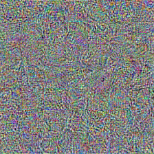
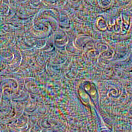
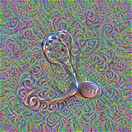
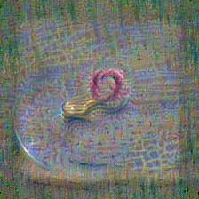
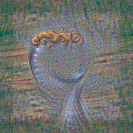
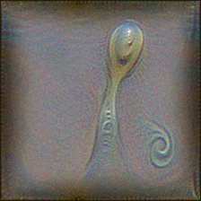
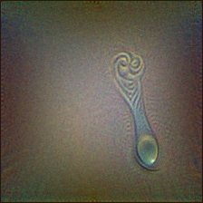
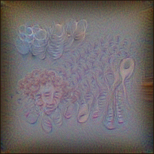
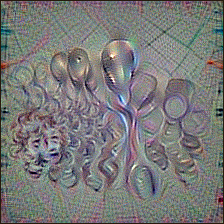

# CLIPig documentation

CLIPig generates images by using the CLIP network as an art critique. 

A bunch of pixels is continuously adjusted to increase the 
similarity of their [features](#targetsfeatures) with some user-defined
target features. Both features are derived via CLIP.

Through [backpropagation](https://en.wikipedia.org/wiki/Backpropagation),
the most common method of training artificial neural networks, the
dissimilarity of trained features and target features is 
translated back into pixel values which adjust the initial bunch of pixels
just slightly. If we do this long enough, with some
artistic variation in the processing pipeline, an actual image emerges.  

CLIPig is designed to allow a lot of control over those *variations* 
which requires a bit of documentation. 

- [introduction](#introduction)
- [command line interface](#command-line-interface)
- [expressions](#expressions)
- [transforms](#transforms)
- [constraints](#constraints)
- [parameter reference](#reference)


## Introduction

First of all, experiments are defined in [YAML](https://yaml.org/) files.
I actually prefer [JSON](https://www.json.org/) but it does not support
comments out of the box and is quite strict with those trailing commas..
Anyways, the basic desires of defining lists and key/value maps are indeed
quite human-friendly in YAML: 

```yaml
a_list:
  - first entry
  - second entry

a_map:
  first_key: first value
  second_key: second value

# a comment
```

And that's all to know about YAML for our purposes. 

Now in CLIPig the *desire* for an image is expressed as a [target](#targets).
There can be multiple targets and each target can have multiple 
[target features](#targetsfeatures).

```yaml
targets:
  - features:
      - text: a curly spoon
```

For a live experience in image generation call

```shell script
python clipig-gui.py
```

paste the code inside the editor (top-left one) and 
press `Alt-S` to start training and watch the image 
emerge in realtime.

So, what does the image look like?



Yeah, well... I promised *images* and now i'm showing nothing more than 
a psychedelic pixel mess. 

But indeed, CLIP does think this image to be **95%** similar 
to the term **a curly spoon**. This is a top scoring that
an actual photo would rarely get and a classic example of an 
[Adversarial](https://en.wikipedia.org/wiki/Adversarial_machine_learning)
in machine learning. 

To make it look more like an actual image we'll add some of those 
artistic variations, spoken of earlier. The art is in showing different
parts of the image to CLIP when evaluating the feature similarities. 

This is accomplished via [transforms](#transforms):

```yaml
targets:
  - features:
      - text: a curly spoon
  transforms:
    - random_shift: 0 1
```



The [random_shift](#targetstransformsrandom_shift) transformation
simply moves the image center to a random position, before
each evaluation by CLIP. The edges are wrapped around so the
outcome is actually a repeatable texture! The object of interest
might just not be in it's center. 

Apropos, the object of interest might look a bit spoony to a
human observer but not so much, i'd say. There is a lot of curliness
in the background but the spoon does not show as much. CLIP also
seems to lack curliness of the spoon because actual letters appeared
to increase the similarity nevertheless. It got to **50%**. 

Another method to inspire CLIP is 
[random rotation](#targetstransformsrandom_rotation). 

```yaml
targets:
  - features:
      - text: a curly spoon
  transforms:
    - random_rotate:
        degree: -90 90
        center: 0.3 .7
```



Each evaluated image is first rotated randomly between -90 and +90 
degree with a random center in the middle 2/3rds of the image. This
does not create a repeatable texture and the edges are typically 
a bit underdeveloped because they get rotated out of the visible 
area a couple of times.

It shows some good areas with shiny metal and spoony curliness but
it's not recognizable as a spoon too much.


Let's go ahead and add some other stuff:

```yaml
targets:
- batch_size: 5
  features:
  - text: a curly spoon on a plate
  transforms:
  - noise: 0.1*ti
  - random_shift: -.1 .1
  - random_rotate:
      degree: -3 3
      center: 0.3 .7
  constraints:
  - blur: 
      kernel_size: 31*ti
```



In desperation we just throw more computation at the
problem by increasing the [batch size](#targetsbatch_size). 
This results in a runtime of about 2 minutes on 1500 cuda cores.

`on a plate` was added to the target text to make CLIP somewhat more 
opinionated about the background.

Some [noise](#targetstransformsnoise) is added to each image that is
shown to CLIP and a gaussian blur is added
to the backpropagation [loss](https://en.wikipedia.org/wiki/Loss_function).  

If you wonder what the `nose: 0.1*ti` means, please check out the
[expressions](#expressions) section. 

The noise makes CLIPig kind of *think twice* about the way 
a pixel is adjusted. The blur used as a training loss tends 
to blur out the areas where CLIP is not interested in, while 
the points of interest are constantly updated and are not 
blurred as much. Unfortunately both methods also help to 
create new artifacts. And this is where those
*variations* start to become *artistic*. 
It certainly takes some patience.

And maybe the correct language. What if we change the target 
text to `a photo of a curly spoon`?



Ah, i see where CLIP is going to. Quite funny indeed, 
but not enough as a proof-of-concept.

```yaml
targets:
- batch_size: 5
  features:
  - text: close-up of a spoon with a curly handle
  transforms:
  - noise: 0.1
  - repeat: 3
  - random_rotate:
      degree: -30 30
      center: .4 .6
  - center_crop: 224
  constraints:
  - blur: 
      kernel_size: 51

postproc:
- border:
    size: 1 1
    color: 0.15 0.1 0.05
```

 


- [Noise](#targetstransformsnoise) and [blur](#targetsconstraintsblur) 
are kept at high values throughout the whole training. 
- The [text target](#targetsfeaturestext) is made extra specific.
- The [repeat](#targetstransformsrepeat) and 
  [center crop](#targetstransformscenter_crop) transforms
  help avoiding the *under-development* of the corners by the 
  stronger [random rotation](#targetstransformsrandom_rotation).
- A [post processing](#postproc) effect adds a small 
  [border](#postprocborder) that forces the contents to be created
  in the center of the image, instead of the repeating edges.
  
  Post-processing effects are applied every epoch and change
  the image pixels directly without interfering with the
  backpropagation stage. All [transforms](#transforms) that
  do not change the resolution are available as 
  [post processing](#postproc) effects.

There is not much else visible in the images because the 
`close-up of ...` in the target text and, more profoundly, 
the high noise and blur constraints do not allow anything 
else to emerge.

Just to give an idea what CLIP is actually *thinking* about
curly spoons, we replace the target text with 
`a lot of curly spoons` and lower the noise value to allow
some more uncertainty in the resulting image:



There are some different concepts visible. Curls made of
spoon faces, curls with interwoven spoon fragments and 
an actual head with curly hair, which probably is to be 
expected when using such a specific adjective. 

The **contrast** of the image is not as good as the previous 
ones. Generally, CLIP does not require a lot of contrast to 
identify things so it's not automatically increased to *normal*
levels. The previous images had a higher noise amount which
actually increased the contrast because areas of low contrast
simply disappear in the noise. Unfortunately, the high noise
deviation only lets things emerge where CLIP is very certain
about. *Curly spoons* do not represent a well-known archetype, 
it seems.

There is a trick, though! We can show CLIP the image with 
much less contrast so the bit of contrast it creates
creates a larger contrast in the final image.

```yaml
targets:
- batch_size: 5
  features:
  - text: a lot of curly spoons
  transforms:
  - noise: 0.1
  - repeat: 3
  - random_rotate:
      degree: -30 30
      center: .4 .6
  - center_crop: 224
  - mul: 1./5.         # CLIP only sees 1/5th of the color range
  constraints:
  - blur:
      kernel_size: 51
  - saturation:        # The desired saturation is lowered
      below: .01       
      weight: 10.
postproc:
- border:
    size: 1
    color: 0.15 0.1 0.05
```



The [mul transformation](#targetstransformsmul) reduces
the color range that CLIP is seeing so the final color
range is increased. Of course, this also increases the 
saturation a lot so the 
[saturation constraint](#targetconstraintssaturation)
is used to reduce it to acceptable levels.

I'll end this chapter here because my 3 years old clearly
approves the image to depict *curly spoons*. And you should 
know the basic pieces needed to create your desired fantasy 
images. 

Just go ahead, play with CLIPig and consume a lot of your 
life or work time. If stuck, check the [reference](#reference) 
and the lists of available [transforms](#transforms) and 
[constraints](#constraints).


## command line interface

A yaml file is rendered via

```shell script
python clipig.py demo.yaml -o images/
```

to produce a [PNG](https://en.wikipedia.org/wiki/Portable_Network_Graphics)
file at `images/demo.png`. When called again, `images/demo-1.png` will be 
created, `images/demo-2.png` the third time, aso.. 

Generally, `clipig.py` never overwrites existing files. 

The `-o` (or `--output`) option is not mandatory but it's good practice
to store those images in separate directories because they tend to grow
in number.

You can specify an actual filename with `-o /path/image.png`, otherwise
the name of the yaml file is used. Still, if `/path/image.png` already
exists, `/path/image-1.png` will be created.

CLIPig also stores a `<filename>.yaml` file besides the image, if there
does not exist one already, which holds the complete configuration with 
all defaults and the runtime in seconds as comment on the top. 

Multiple yaml files are merged into one set of parameters, e.g.:

```shell script
python clipig.py best-meta-settings.yaml specific.yaml
```

will parse `best-meta-settings.yaml` and then add anything
from `sepcific.yaml` on top. List entries 
like [targets](#targets) will be appended to the previous list.


## Expressions

CLIPig supports expressions for all parameters. Some parameters
also support variables and the expression will be evaluated
every time the value is needed. 

E.g., if you want thrice the CLIP-resolution of 224x224 pixels
but are too lazy to calculate it, just say:

```yaml
resolution: 224*3
```

> **Note**: Parameters that expect lists (like **resolution** above)
> copy a single value to all entries of the list. A list can 
> be specified with 
> - YAML syntax:
>   ```yaml
>   resolution: 
>     - 640
>     - 480
>   ```
> - with commas:
>   ```yaml
>   resolution: 640, 480
>   ```
> - or simply with spaces
>   ```yaml
>   resolution: 640 480
>   ```
> If you type expressions, you might want to use spaces or 
> commas. In cse of list parameters you'll need to use the 
> YAML lists:
> ```yaml
> resolution:
>   - 224 * 3
>   - pow(224, 1.2)
> ``` 

The result of an expression is automatically converted to 
the desired type. So even if your `resolution` expression 
generates a float it will be cast to integer before being used.

> **Note**: Divisions through zero and stuff like this will
> throw an error and stop the experiment.


## Transforms

Transforms shape the area of the trained image before showing
it to CLIP for evaluation. 
  
Here's a list of all available transformations:

{{transforms}}

All [transforms](#transforms) that do not change the 
resolution of the image are also available as 
[post processing](#postproc) effects.


## Constraints 

Constraints do influence the trained image without using CLIP.
E.g., the image [mean](#targetsconstraintsmean) can be trained
to be above or below a specific threshold. 

Constraints only affect the pixels that are processed by
the [transforms](#transforms) of the [target](#targets). 

Here's a list of all available constraints:

{{constraints}}


## Reference

{{reference}}