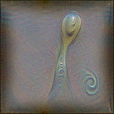
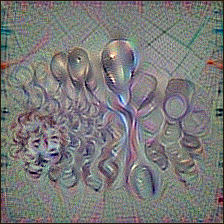
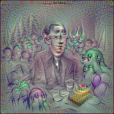
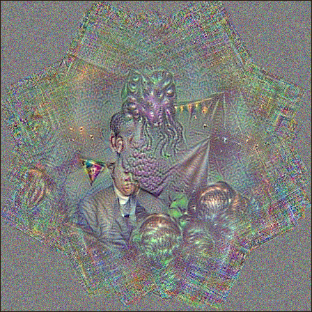
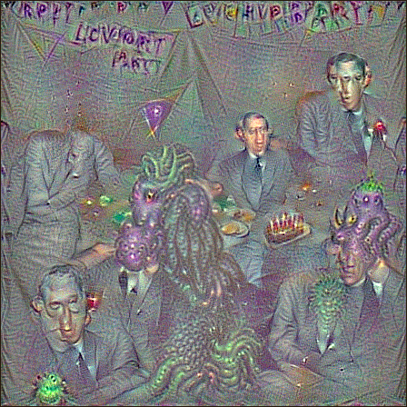
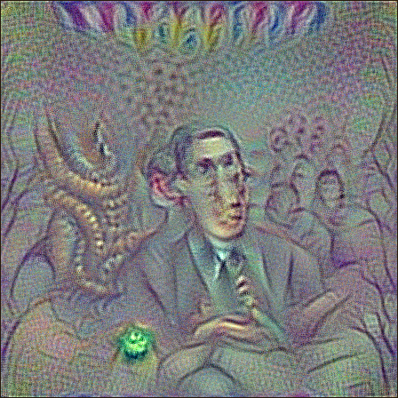
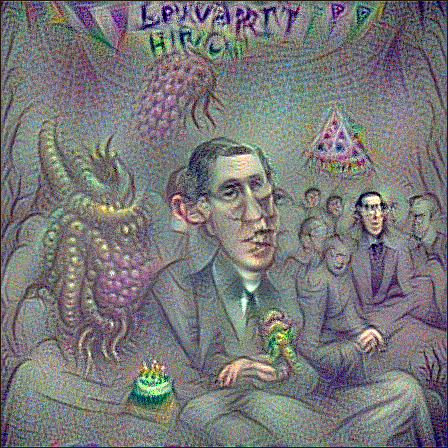
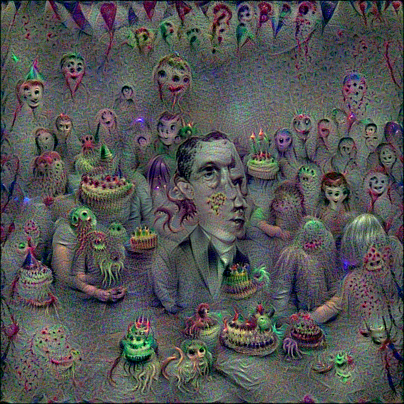
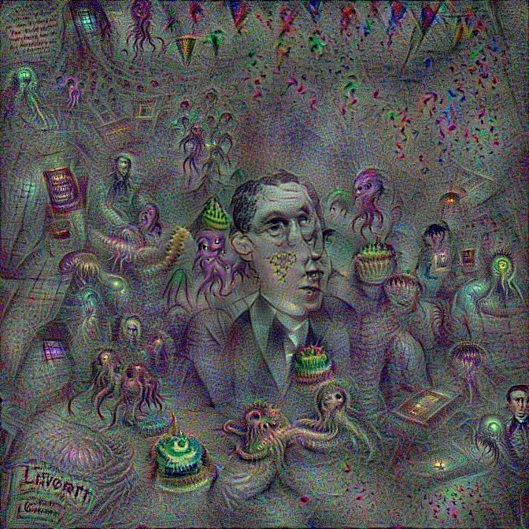

# Walk-through

## YAML basics

First of all, [CLIPig](https://github.com/defgsus/CLIPig/)-experiments are defined in [YAML](https://yaml.org/) 
files. I actually prefer [JSON](https://www.json.org/) but it 
does not support comments out of the box and is quite strict 
with those trailing commas and all that.. Anyways, the basic 
desires of defining lists and key/value maps are indeed
quite human-friendly in YAML: 

```yaml
a_list:
  - first entry
  - second entry

a_map:
  first_key: first value
  second_key: second value  # a comment
```

And that's all to know about YAML for our purposes. 

There is one particularity in CLIPig: Value lists can be defined
via YAML lists or via comma or space separation, e.g:

```yaml
resolution:
 - 1024
 - 768
```

is the same as 
```yaml
resolution: 1024 768
```
or
```yaml
resolution: 1024, 768
```

## Defining targets

Now in [CLIPig](https://github.com/defgsus/CLIPig/) the *desire* for an image is expressed as a 
[target](reference.md#targets).
There can be multiple targets and each target can have multiple 
target [features](reference.md#targetsfeatures).

```yaml
targets:
  - features:
      - text: a curly spoon
```

To follow the walk-through, call

```shell
python clipig-gui.py
```

then paste the code inside the editor (top-left one) and 
press `Alt-S` to start training and watch the image 
emerge in realtime.

So, what does it look like?


Yeah, well... I promised *images* and now i'm showing nothing 
more than a psychedelic pixel mess. 

But indeed, [CLIP](https://github.com/openai/CLIP/) does think this image to be **95%** similar 
to the words **a curly spoon**. This is a top score that
an actual photo would rarely get and a classic example of an 
[adversarial](https://en.wikipedia.org/wiki/Adversarial_machine_learning)
in machine learning.

> Note: Throughout this text **similarity** is spoken of as percentage
> which is not really the case. It's actually the 
> [cosine similarity](https://en.wikipedia.org/wiki/Cosine_similarity)
> (times **100**) or in other words, the dot-product of two normalized
> vectors.  

To produce an actual image we'll add some of those 
artistic variations, spoken of earlier. The art is in showing 
different parts of the image to [CLIP](https://github.com/openai/CLIP/) when evaluating the 
feature similarities. 

This is accomplished via [transforms](transforms.md):

```yaml
targets:
  - features:
      - text: a curly spoon
  transforms:
    - random_shift: 0 1
```


The [random_shift](reference.md#targetstransformsrandom_shift) transformation
simply moves the image center to a random position, before
each evaluation by [CLIP](https://github.com/openai/CLIP/). The edges are wrapped around so the
outcome is actually a repeatable texture! The object of interest
might just not be in it's center. 

It looks a bit spoony but not really, i'd say. There is a lot of curliness
in the background but the spoon does not show as much. 

Also [CLIP](https://github.com/openai/CLIP/) missed the curliness of the spoon 
because actual letters appeared to increase the similarity 
nevertheless. It got to **50%**. 

Another method to inspire [CLIP](https://github.com/openai/CLIP/) is 
[random rotation](reference.md#targetstransformsrandom_rotate). 

```yaml
targets:
  - features:
      - text: a curly spoon
  transforms:
    - random_rotate:
        degree: -90 90
        center: 0.3 .7
```


Each evaluated image is first rotated randomly between -90 and +90 
degree with a random center in the middle 2/3rds of the image. This
does not create a repeatable texture and the edges are typically 
a bit underdeveloped because they get rotated out of the visible 
area some amount of time.

The image shows some good areas with shiny metal and spoony 
curliness but it's still not quite recognizable as a spoon.

Let's jump forward and add some other stuff:

```yaml
targets:
- batch_size: 5
  features:
  - text: a curly spoon on a plate
  transforms:
  - noise: 0.1*ti
  - random_shift: -.1 .1
  - random_rotate:
      degree: -3 3
      center: 0.3 .7
  constraints:
  - blur: 
      kernel_size: 31*ti
```


In desperation we just throw more computation at the
problem by increasing the [batch size](reference.md#targetsbatch_size). 
This results in a runtime of about 2 minutes on 1500 cuda cores.

Then, `on a plate` was added to the target text to make 
[CLIP](https://github.com/openai/CLIP/) somewhat more opinionated about the background.

Some [noise](reference.md#targetstransformsnoise) is added to each image 
before showing it to [CLIP](https://github.com/openai/CLIP/) and a [gaussian blur](https://en.wikipedia.org/wiki/Gaussian_blur) is added
to the backpropagation [loss](https://en.wikipedia.org/wiki/Loss_function).  

For details about the `noise: 0.1*ti` line, please check out the
[expressions](expressions.md) section. Sufficient to say that it 
decreases the amount of noise over time. 

The noise makes [CLIPig](https://github.com/defgsus/CLIPig/) kind of *think twice* about the way 
a pixel is adjusted. The blur as a training loss tends 
to blur out the areas where [CLIP](https://github.com/openai/CLIP/) is not much interested in, while 
the points of interest are constantly updated and are not 
blurred as much. Unfortunately both methods also help to 
create new artifacts. And this is where those
*variations* start to become *artistic*. 
It certainly takes some patience.

And maybe the correct language. What if we change the target 
text to `a photo of a curly spoon`?


Ah, i see where you are going, CLIP! Indeed funny, 
but not enough for a proof-of-concept.

```yaml
targets:
- batch_size: 5
  features:
  - text: close-up of a spoon with a curly handle
  transforms:
  - noise: 0.1
  - repeat: 3
  - random_rotate:
      degree: -30 30
      center: .4 .6
  - center_crop: 224
  constraints:
  - blur: 
      kernel_size: 51

postproc:
- border:
    size: 1 1
    color: 0.15 0.1 0.05
```

 


Changes made:

- [Noise](reference.md#targetstransformsnoise) and [blur](reference.md#targetsconstraintsblur) 
are kept at high values throughout the whole training. 
- The [text target](reference.md#targetsfeaturestext) is made extra specific.
- The [repeat](reference.md#targetstransformsrepeat) and 
  [center crop](reference.md#targetstransformscenter_crop) transforms
  help avoiding the *under-development* of the corners by the 
  [random rotation](reference.md#targetstransformsrandom_rotate).
- A [post processing](reference.md#postproc) effect adds a small 
  [border](reference.md#postprocborder) that forces the contents to be 
  created more in the center of the image instead of close 
  to or on one of the repeating edges.
  
  Post-processing effects are applied every epoch and change
  the image pixels directly without interfering with the
  backpropagation stage. All [transforms](transforms.md) that
  do not change the resolution are available as 
  [post processing](reference.md#postproc) effects.

There is not much else visible in the images because the 
`close-up of ...` in the target text and, more profoundly, 
the high noise and blur constraints do not allow anything 
else to emerge.

Just to give an idea what [CLIP](https://github.com/openai/CLIP/) is actually *thinking* about
curly spoons, the target text is replced with with 
`a lot of curly spoons` and the noise value is lowered to 
allow some more uncertainty in the resulting image:


There are some different concepts visible. Curls made of
spoon faces, curls with interwoven spoon fragments and 
an actual head with curly hair, which probably is to be 
expected when using such a specific adjective. 

The **contrast** of the image is not as good as the previous 
ones. Generally, [CLIP](https://github.com/openai/CLIP/) does not require a lot of contrast to 
identify things so it's not automatically increased to *normal*
levels. The previous images had a higher noise amount which
actually increased the contrast because areas of low contrast
simply disappear in the noise. Unfortunately, the high noise
deviation only lets things emerge where [CLIP](https://github.com/openai/CLIP/) is very certain
about. *Curly spoons* do not represent a well-known archetype, 
it seems.

There is a trick, though! We can show [CLIP](https://github.com/openai/CLIP/) the image with 
much less contrast so the changes it applies become
larger changes in the final image.

```yaml
targets:
- batch_size: 5
  features:
  - text: a lot of curly spoons
  transforms:
  - noise: 0.1
  - repeat: 3
  - random_rotate:
      degree: -30 30
      center: .4 .6
  - center_crop: 224
  - mul: 1./5.         # only show a 5th of the color range
  constraints:
  - blur:
      kernel_size: 51
  - saturation:        # The desired saturation is lowered
      below: .01       
      weight: 10.
postproc:
- border:
    size: 1
    color: 0.15 0.1 0.05
```



The [mul transformation](reference.md#targetstransformsmul) reduces
the color range that [CLIP](https://github.com/openai/CLIP/) is seeing so the resulting color
range is increased. Of course, this also increases the 
saturation a lot so the 
[saturation constraint](reference.md#targetsconstraintssaturation)
is used to reduce it to acceptable levels.

I'll end this experiment here because my 3 years old daughter 
clearly approves the image to depict *curly spoons*. 
And you should know the basic pieces now, that are needed to 
create your desired fantasy images. 

Just go ahead, play with [CLIPig](https://github.com/defgsus/CLIPig/) and consume a lot of your 
life and work time. If stuck, check the [reference](reference.md) 
and the lists of available [transforms](transforms.md) and 
[constraints](constraints.md).

But there's one thing left: **How do i increase 
the resolution?**

## Increasing resolution

Okay, let's start with a new theme. Take the curly spoon script
from above and replace the text with `h.p. lovecraft at a 
birthday party`.



If you don't know [Lovecraft](https://en.wikipedia.org/wiki/H._P._Lovecraft), 
he's one of the earliest and 
spookiest fantasy authors with stories about creepy and
*unearthly* things and obviously enough fan-art has found it's
way into [CLIP](https://github.com/openai/CLIP/)'s convolutional weight matrices. The green guy
there must be a children's birthday version of *Cthulhu*, an 
age-old murderous god living in the sea, waiting for a come-back
as leader of a blood-thirsty army of fanatics.

Why does Lovecraft have .. ahh, two faces? Well, my personal 
feeling is that [CLIP](https://github.com/openai/CLIP/) does not reject a face just because 
it's melted together with parts of other faces or not at the
right place above the shoulders, aso. Similarity to *Lovecraft at
a birthday party* got to **61%**, despite the creepy head. 
[CLIP](https://github.com/openai/CLIP/) just imagined the face at two different 
positions. If we continue training for long enough, it *might* 
correct the face. But only, if that increases similarity to the
target feature.

Anyways, let's increase the resolution by putting this line
in front:

```yaml
resolution: 224*2
```

This is now **twice** the width and height of [CLIP](https://github.com/openai/CLIP/)'s image input
window or **four** times as much pixels as before.



What did happen? Well, the 
[center_crop](reference.md#targetstransformscenter_crop) transformation
crops a [CLIP](https://github.com/openai/CLIP/)-sized 224² window from the middle of a 448² image. 
It is not helpful unless to show us the effect of the 
random rotation. 

We could add the [random_shift](reference.md#targetstransformsrandom_shift)
transform to move the [CLIP](https://github.com/openai/CLIP/) window to every position of the 
training image. Let's just do that and also increase the
[batch_size](reference.md#targetsbatch_size) from **5** to **20** since
we have 4 times the pixels to process.



There are many Lovecrafts now. It's like in this 
John Malkovich movie when John Malkovich truckles through the
door that leads into his own head. There's even a body without
a head.

Clearly, [CLIP](https://github.com/openai/CLIP/) does not get a good view of the whole image but
just assembles parts of it without the knowledge of how they
relate to each other. It's perfectly fine for textures and
fantasy wallpapers but let's see if we can create a good 
composition in higher resolution.

The [random_scale](reference.md#targetstransformsrandom_scale) 
transformation allows us to *'zoom'* in or out of the
image so we can show [CLIP](https://github.com/openai/CLIP/) a mixture of the whole image
and details of it.

Imagine a zoom, or scale, of **0.5** on the training image.
That would mean that [CLIP](https://github.com/openai/CLIP/) sees twice as much in each 
direction or 4 times as much in the whole. Exactly our new
resolution. Of course it would not look better than resizing an
image to a larger resolution with some bilinear filtering.
Well, not entirely. The noise and artifacts are of higher
resolution ;) 



Now, at some point in training we randomly 
[scale](reference.md#targetstransformsrandom_scale) 
between the full resolution and the zoomed-in details
and enable the [random_shift](reference.md#targetstransformsrandom_shift).

`0. if t < .4 else 1.` is python/[CLIPig](https://github.com/defgsus/CLIPig/) talk for 
*zero below 40% else one*. 


```yaml
epochs: 300
resolution: 224*2
targets:
  - batch_size: 20
    features:
      - text: h.p. lovecraft at a birthday party
    transforms:
      - noise: 0.1
      - repeat: 3
      - random_shift:
          - 0
          - 0 if t < .4 else 1. 
      - random_rotate:
          degree: -30 30
          center: .4 .6
      - random_scale:
          - .5
          - .5 if t < .4 else 1.
      - center_crop: 224
      - mul: 1./5.
    constraints:
      - blur:
          kernel_size: 51
      - saturation:
          below: .01
          weight: 10.
postproc:
  - border:
      size: 1
      color: 0.15 0.1 0.05
```



It's quite good at parts but, wait! There's already another 
Lovecraft developing in the background. And that's what is to be 
expected. The training target of that Lovecraftian party is
simply applied at all points of the image and [CLIP](https://github.com/openai/CLIP/) won't 
jude the whole frame less similar to the target just because every
face is that of Howard Phillips.

The above snapshot is kind'o good but the repetitions will
increase with higher resolutions. It would be more like a fractal
of H.P.'s birthday party. 

... Well actually, let's see *a fractal of H.P.'s birthday party*


Well done CLIP, well done.

But back to the topic. We'll start with the blurry Lovecraft picture
above and train the image details with non-lovecraft targets:

```yaml
epochs: 500
resolution: 224*3

# load the previous image
init:
  image: docs/static/img/hpl4-c.png
  mean: 0.0
  std: 1.0

# lower the brightness a bit
postproc:
  - mean: .33

targets:
  - name: lovecraft
    batch_size: 3
    features:
      - text: h.p. lovecraft at a birthday party
    transforms:
      - noise: 0.1
      - random_rotate:
          degree: -30 30
          center: .4 .6
      - center_crop: width/2
      - random_crop: 224
      - mul: 1./5.
    constraints:
      - blur:
          kernel_size: 51
      - saturation:
          below: 0.01
          weight: 10.0

  - name: party details
    batch_size: 5
    features:
      - text: people at a creepy birthday party
    transforms:
      - noise: 0.1
      - random_shift: 0 1
      - random_rotate:
          degree: -30 30
          center: .4 .6
      - random_scale: .5 1.5
      - center_crop: 224
      - mul: 1./5.
    constraints:
      - blur:
          kernel_size: 11

  - name: special details
    start: 30%
    batch_size: 5
    select: best
    features:
      - text: cthulhuian birthday cakes
      - text: creepy confetti
        weight: 0.5
      - text: lovecraft's interior
        weight: 0.7
      - text: cthulhu
        weight: 0.8
    transforms:
      - noise: 0.1
      - random_shift: 0 1
      - random_rotate:
          degree: -30 30
          center: .4 .6
      - random_scale: .7 1.5
      - center_crop: 224
      - mul: 1./5.
    constraints:
      - blur:
          kernel_size: 51
      - saturation:
          below: 0.01
          weight: 10.0
```

And 10 minutes later:



Only one Lovecraft in the image! And many interesting details. 

Here's a summary about the different applied targets:

The `lovecraft` target keeps the original theme intact, at 
  least in the center of the image.
```yaml
  - center_crop: width/2
  - random_crop: 224
```
We crop the middle part of the randomly rotated image and then randomly crop a 
[CLIP](https://github.com/openai/CLIP/)-window from that. That certainly does not help *correcting* the face but 
it's not so bad, either.

The `party details` target simply crops randomly from the whole image and applies
the *people at a creepy birthday party* text feature.

The `special details` target starts at 30% of the training and applies the best
matching feature of a few different features to the randomly cropped window.

It starts late to give the `special details` target a bit of time to create
the people in the background. The `select: best` mode chooses only one feature
at a time. Here are the counts after the training: 

```
lovecraft       : h.p. lovecraft at a birthday party : count 1500 (100.0%) / sim 53.377 
party details   : people at a creepy birthday party  : count 2500 (100.0%) / sim 34.222 
special details : cthulhuian birthday cakes          : count 740  (42.3 %) / sim 30.744 
                : creepy confetti                    : count 985  (56.3 %) / sim 30.427 
                : lovecraft's interior               : count 22   (1.3  %) / sim 25.249 
                : cthulhu                            : count 3    (0.2  %) / sim 25.261 
```

So, `lovecraft's interior` and `cthulhu` did not really get a chance. 

The match rate of features 
is quite dependent on various other parameters and may 
change during several runs. Below is another experiment where *lovecraft's interior*
did get a far better match because the word *creepy* was removed from 
*"people at a creepy birthday party"*. 



So, to summarize the topic of high resolution [CLIPig](https://github.com/defgsus/CLIPig/) images:
It's tricky stuff.